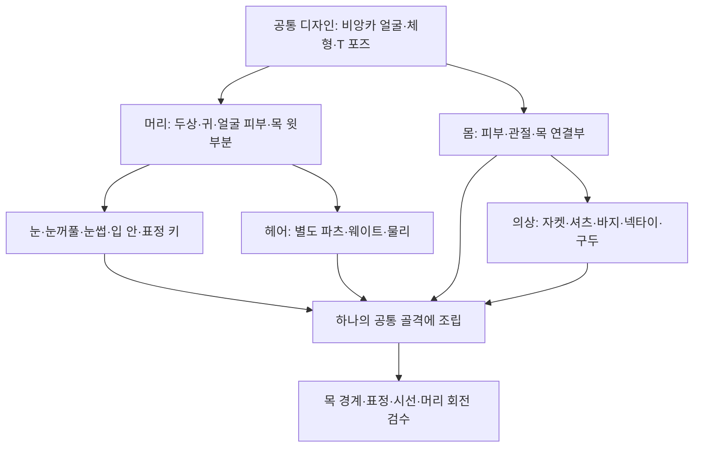

# v006 · 얼굴·몸을 분리해서 제작하는 방안

2026-09-15 · 별도 R&D / 공식 자료와 저장 자산 확인 / 모델 편집 미실행

**비앙카의 얼굴을 몸과 별도 제작하는 방안을 우선 비교 후보로 추천한다.** 몸·의상은 Tripo 결과를 출발점으로 시험하고, 머리는 얼굴 인상과 표정 변형을 중심으로 따로 완성하는 구조다. 분리만으로 얼굴이 좋아지지는 않는다. 얼굴에 별도의 입력 이미지·작업 시간·면 구성·텍스처·표정 검수를 배정하는 것이 핵심이다.

사용자의 “Tripo가 얼굴을 잘 못 만드는 듯하다”는 현재 작업 경험으로 기록한다. 이번에는 실제 Tripo 출력 메시를 새로 가져와 검사하지 않았으므로, 서비스 전체의 얼굴 품질을 판정하거나 비앙카 실패 원인을 확정하지 않는다.

## 1. 얼굴 앞면보다 머리 전체를 작업 단위로

| 분리 방법 | 장점 | 필요한 작업 | 판단 |
|---|---|---|---|
| 얼굴의 앞쪽 피부만 교체 | 기존 뒤통수·귀를 남길 수 있음 | 이마·관자놀이·턱 주변의 긴 경계, 표정 변형 때 접합부 유지 | 특정 부위 국소 수리에는 가능하지만 이번 첫 선택으로는 비추천 |
| **두상·얼굴 피부·귀·목 윗부분을 머리 파츠로** | 얼굴·눈·입의 비율과 표정을 한 단위로 관리, 몸 수정과 분리 | 목의 공통 연결선과 머리 크기·위치·피부색·웨이트 맞춤 | **이번 권장 작업 단위** |
| 전신 통합 생성 후 얼굴만 다듬기 | 조립은 단순, 현재 방식과 가까움 | 얼굴 면 구성이 나쁘면 재구성과 표정 제작 범위가 커짐 | 비교 기준으로 보존 |

여기서 ‘머리 파츠’는 작업 묶음이다. 눈알·속눈썹·눈썹·입 안·머리카락까지 한 메시로 합치자는 뜻은 아니다. 특히 머리카락은 얼굴 피부와 독립적으로 다루는 편이 이번 정돈 작업과 잘 맞는다.

작업 중 독립 오브젝트로 관리해도 같은 골격에 연결할 수 있다. 배포 시 피부를 연결하거나 일부 렌더러를 합칠지는 나중에 판단한다. **작업 단위 분리와 최종 메시 수는 별개**다.

## 2. 머리는 무엇으로 만들까

| 후보 | 비앙카에 대한 기대 | 한계·확인할 점 | 우선순위 |
|---|---|---|---|
| 기존 비앙카 머리 외형을 재사용하고 필요한 면 구성·표정 보완 | 이미 맞춰온 인상을 유지할 가능성 | 현재 얼굴이 독립적으로 추출되는지, 눈꺼풀·입 안·표정 품질은 실제 검사 필요 | 먼저 재사용 가능성 확인 |
| **얼굴 전용 기본 메시를 원화에 맞춰 직접 수정** | 눈·코·입·턱의 인상과 변형을 가장 직접적으로 제어 | 초기 모델링·UV·표정 제작 비용 | 외형 일치와 표정 품질을 위한 주 제작 후보 |
| Tripo에 머리만 별도로 생성시켜 비교 | 전신 입력보다 얼굴을 크게 제시하고 별도 수정 가능 | 눈/입 내부·깜박임·말하기용 면 구성은 별도 검증, 재생성만 반복해도 해결되지 않을 수 있음 | 빠른 비교용 후보 |
| VRoid 같은 아바타 제작 도구의 머리를 바탕으로 수정 | 얼굴 조절·표정 편집 기반에서 출발 가능 | 비앙카 특유의 인상으로 맞추는 수정과 몸/골격 조립이 필요 | 대안, 이번 설치·전환은 하지 않음 |

Tripo 공식 제작 사례는 머리를 별도 자산으로 분리하고 Head Extraction을 사용하는 흐름을 설명한다. 개별 생성 파츠는 DCC에서 배율과 위치를 다시 맞추며, 제작용 리깅에는 수작업을 권한다. 이는 **분리 생성이 유효한 작업 전략이라는 근거**이고, 비앙카 얼굴이나 표정의 자동 완성을 보장하는 근거는 아니다. 사례의 시간·품질 수치를 우리 작업의 예상치로 사용하지 않는다. [Tripo 공식 제작 사례](https://www.tripo3d.ai/blog/game-industry-character-workflow).

Tripo의 확인한 Auto Rig API는 모델에 골격을 추가하는 기능으로 설명된다. 해당 문서만으로 눈꺼풀·입 안·말하기 표정까지 완성된다고 판단할 수 없다. [Tripo Auto Rig 공식 문서](https://developers.tripo3d.ai/en/docs/animations-rig).

VRoid의 얼굴 편집 안내에는 Expression Editor가 있고, 공식 안내는 VRM 내보내기를 설명한다. 이것을 비앙카에 그대로 쓸 수 있는 별도 머리 납품 기능이나 원화 자동 재현 기능으로 해석하지 않는다. [VRoid 얼굴 편집](https://vroid.pixiv.help/hc/en-us/sections/900001865103-Face-Editor), [VRoid 내보내기](https://vroid.pixiv.help/hc/en-us/articles/360012474773-Camera-Exporter).

## 3. 얼굴 품질은 정지 화면과 표정을 나눠 확인

원화와 닮은 정지 얼굴만으로는 아바타 얼굴이 완성되지 않는다. 눈둘레·입둘레가 닫히고 열리는 면 흐름, 눈알과 눈꺼풀의 맞물림, 입 안의 깊이와 필요한 치아·혀, 눈썹과 속눈썹의 움직임을 함께 제작해야 한다. 생성 결과가 사각형 위주여도 이 변형에 적합한 면 흐름이라는 보장은 없다.

최소 검토 묶음은 **중립 정면/사선/측면 → 양눈 깜박임·좌우 윙크 → 시선 상하좌우 → 입 닫힘·벌림·미소·발음형 → 복합 표정과 중립 복귀**다. 얼굴 트래킹을 사용할 때는 목표 표정 매핑도 별도로 확인한다. 표정마다 별도의 AI 모델을 생성하면 서로 다른 정점 구조가 생길 수 있으므로, 하나의 머리 메시를 변형하는 방식으로 표정을 제작하는 것을 기본안으로 둔다.

VRChat은 발음형 blendshape/shape key를 립싱크에 사용하는 구성을 안내한다. 얼굴을 다른 렌더러로 옮기면 해당 메시와 키를 가리키는 설정도 다시 연결·검수해야 한다. [VRChat 공식 립싱크 안내](https://creators.vrchat.com/avatars/creating-your-first-avatar/#lip-sync-mode).

## 4. 목 연결에서 생길 수 있는 추가 비용

- **위치와 크기:** 먼저 키·머리 크기·눈높이·목 길이·정면 방향·T 바인드 포즈를 같은 기준으로 맞춘다. 머리와 몸을 각각 자동 리깅한 두 골격을 겹쳐놓는 것으로 끝내지 않는다.
- **피부 경계:** 머리와 몸의 목 경계가 만나는 위치와 흐름을 정의한다. 분리 상태라면 경계 양쪽 좌표와 웨이트가 함께 움직여야 하고, 최종 연결한다면 UV·노멀·키 보존을 검수한다. 조금 겹쳐 숨기는 것만으로 해결됐다고 판정하지 않는다.
- **회전과 표정:** 머리를 돌리거나 숙였을 때 틈·음영 띠·안쪽 겹침이 생기는지 확인한다. 목 경계는 표정 키가 불필요하게 움직이지 않도록 설계한다.
- **재질:** 얼굴과 몸이 같은 피부색이어도 텍스처 명암·법선·셰이더 효과가 다르면 목에 띠가 생길 수 있다. 조명 조건을 바꿔 확인한다.

속옷형으로도 쓸 모델이므로 셔츠 카라로 목 이음새를 가리는 것을 합격 기준으로 삼지 않는다.

## 5. 현재 자료에서 확인한 것과 다음 실험

이번에 저장된 v352 Final.prefab 및 BodyHair/Coat 메시 자산 3파일을 읽기 전용으로 확인했다. 세 파일 모두 앞선 v001 조사 기록과 바이트 해시가 같다. BodyHair에는 얼굴·헤어를 포함한 재질 슬롯 7개가 있고, Coat는 별도다. **얼굴 재질 슬롯의 존재는 목에서 분리 가능한 완성 머리 파츠의 존재를 증명하지 않는다.**

BodyHair 저장 파일에는 이름상 기존 관절·손 보정 계열인 shape 채널 26개가 있다. 이번 확인은 저장된 채널 이름과 구조까지이며, 사용 가능한 깜박임·발음형 세트가 준비되어 있다는 근거로 사용하지 않는다. 정점 경계·입 안·눈꺼풀의 실제 검사와 키 구동은 수행하지 않았다. 상세 경로·해시·채널 목록은 작업 저장소의 `source/LOCAL_AUDIT.json`에 보존한다. [이전 몸·의상 구조 조사](../v001_body_clothing_separation/v001_RESEARCH.md).

후속 제작을 진행한다면 다음과 같이 비교할 것을 제안한다.

1. **얼굴 전용 기준 그림:** 정면·오른쪽·왼쪽·뒤의 머리 확대본과 사선 검토본을 준비한다. 모델링용 그림에서는 앞머리를 치워 양눈·눈썹·귀·이마·턱·목이 보이게 하고, 현재 한쪽 눈을 가리는 헤어 디자인은 별도 참고로 유지한다. 이는 캐릭터 헤어를 없애자는 제안이 아니다.
2. **같은 몸에 머리 후보 두 개:** 기존 얼굴 재사용/직접 수정 후보와 Tripo 머리 단독 생성 후보를 같은 머리 크기·눈높이·목 기준에 맞춰 비교한다. 전신 Tripo의 원래 머리는 임시 비교 기준으로 보존한다. 머리 없는 몸의 자동 리깅 호환성은 가정하지 않는다.
3. **중립보다 깜박임·입 벌림을 일찍 시험:** 눈 감기와 입 벌리기에서 큰 재작업이 필요하면 고해상도 텍스처를 먼저 완성하지 않고 면 구성부터 정리한다.
4. **통합 결정:** 얼굴 외형·표정·목 회전이 맞는 후보를 고른 뒤 헤어와 의상을 연결한다. 먼저 얼굴 품질을 고정하면 이후 몸/옷을 반복 생성해도 얼굴을 함께 바꿀 필요가 줄어든다.

이번에는 **설계안과 읽기 전용 확인만 완료**했다. 새 얼굴 이미지·머리 메시 생성, 기존 얼굴 절단·교체, Tripo 업로드, Blender/Unity 실행은 하지 않았다. 기존 모델의 신규 메시/부분 대체 제한과 작업 중단 결정을 이 조사로 해제하지 않는다. 별도 R&D의 방향 제안이며 채택이나 구현 완료는 아니다.
