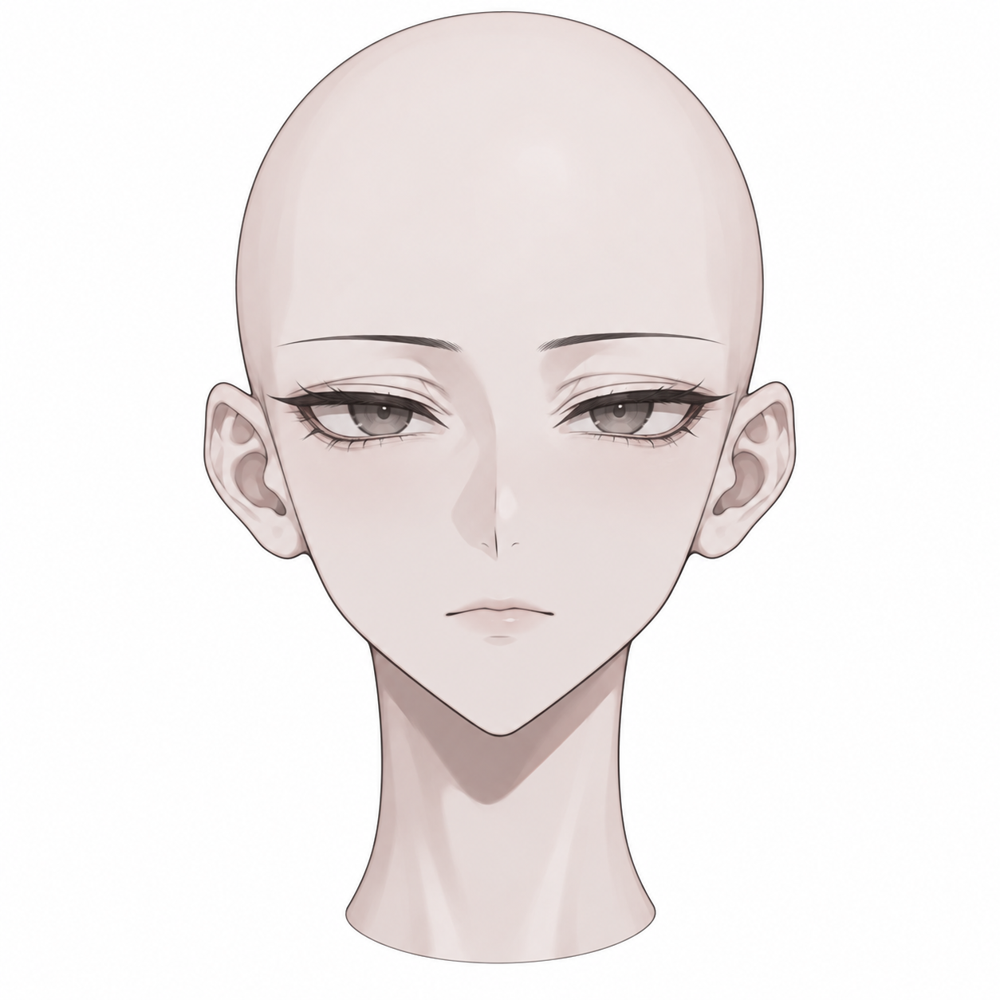
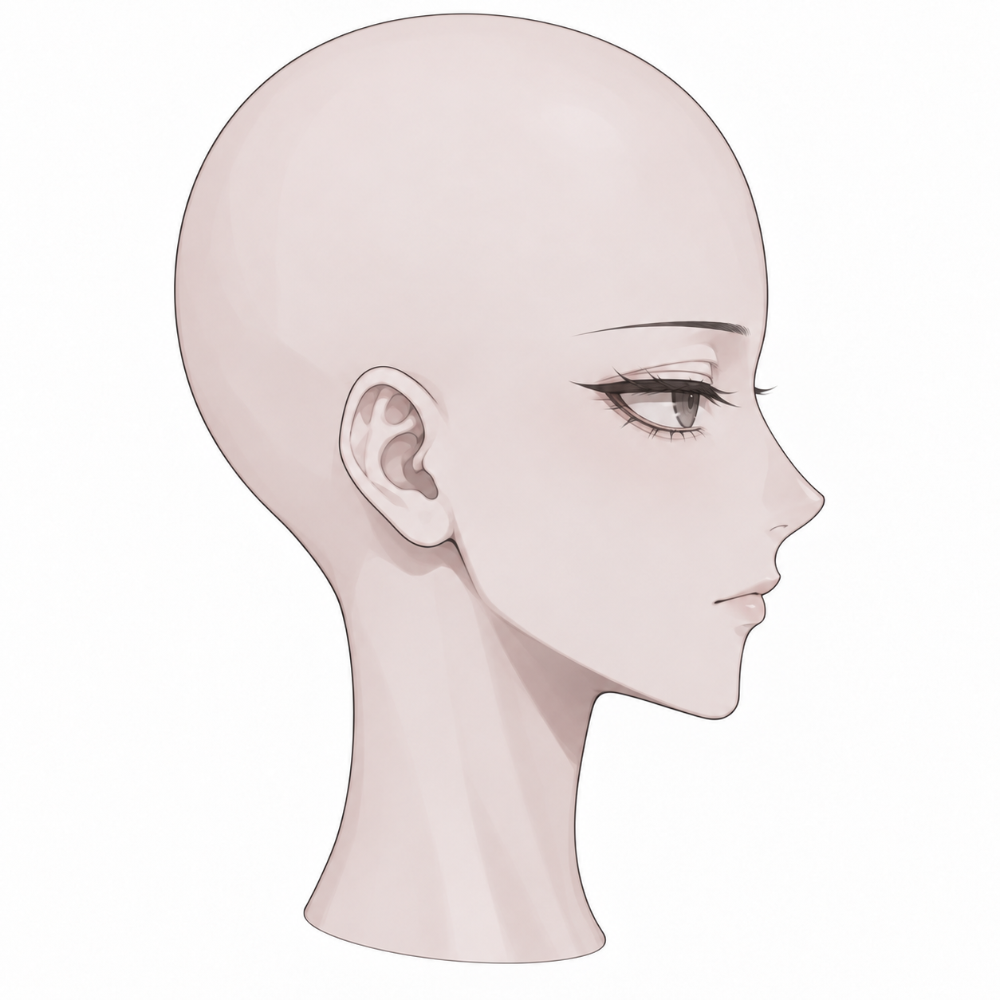
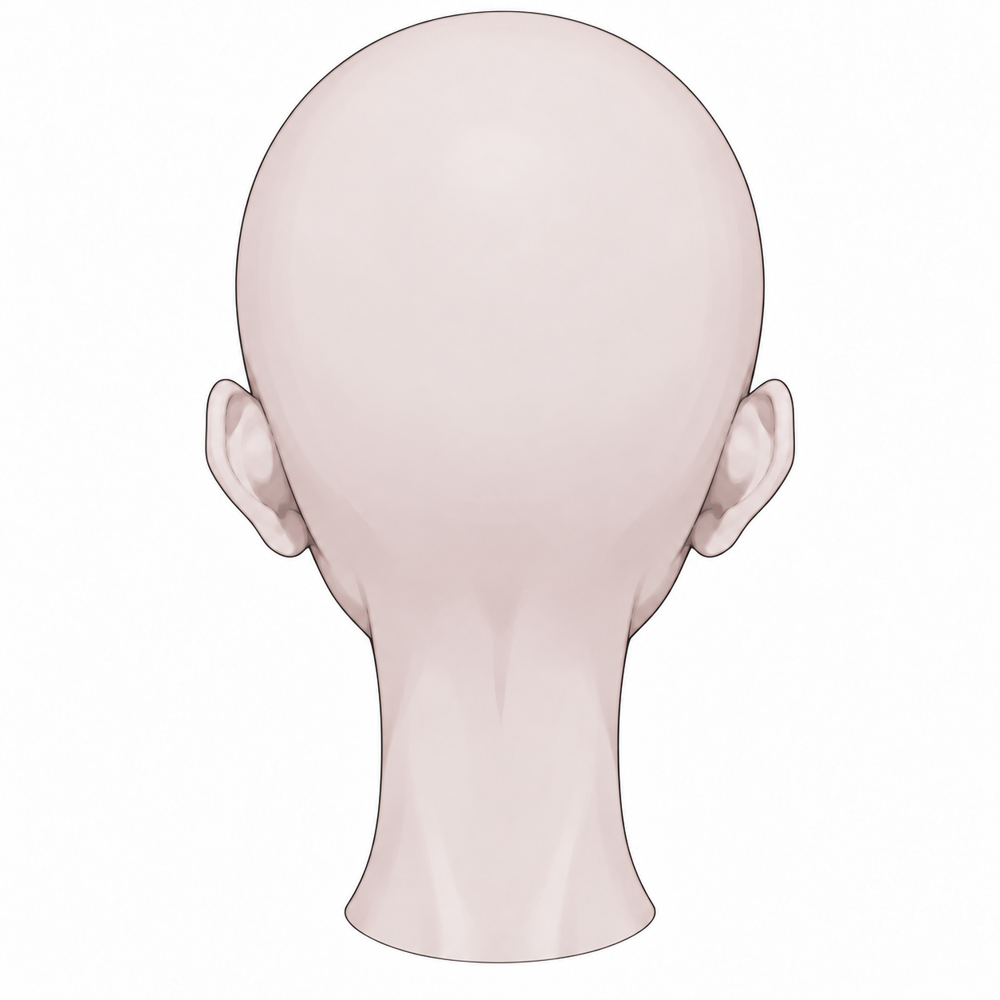
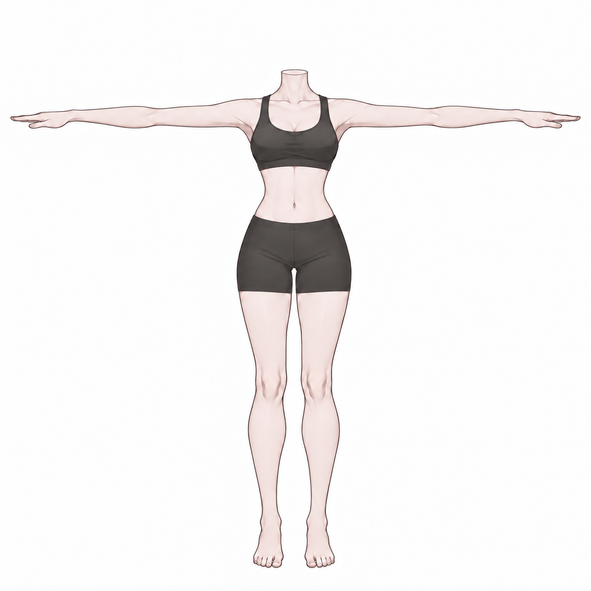
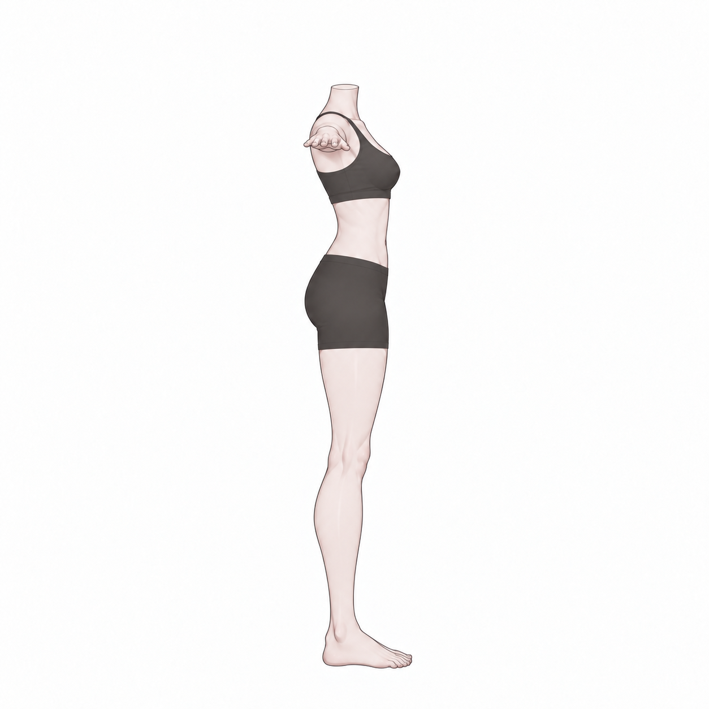
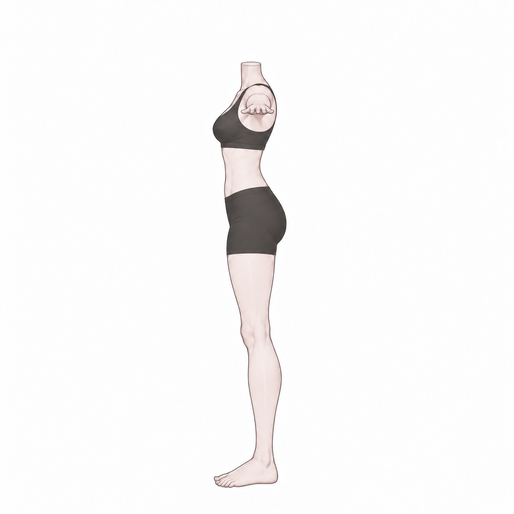
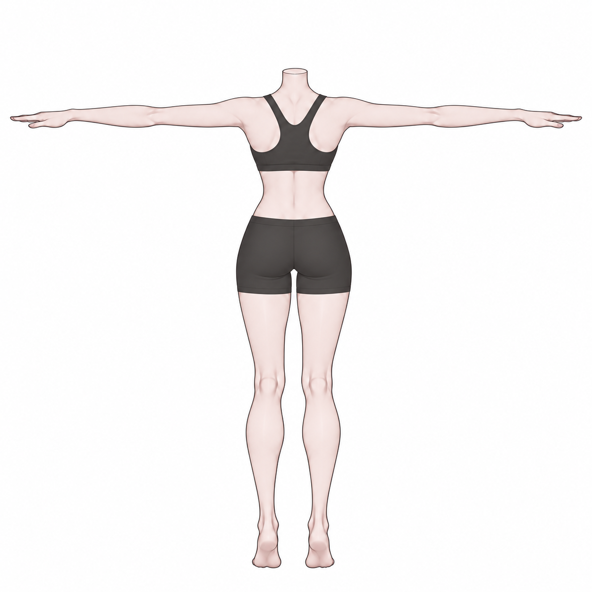
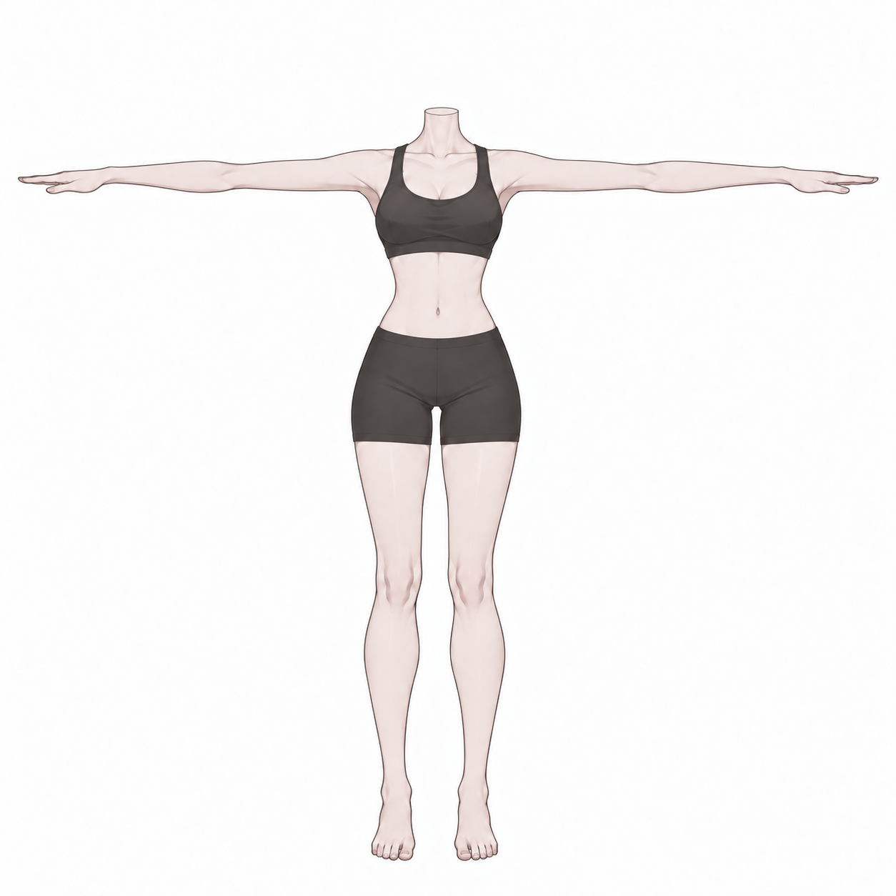
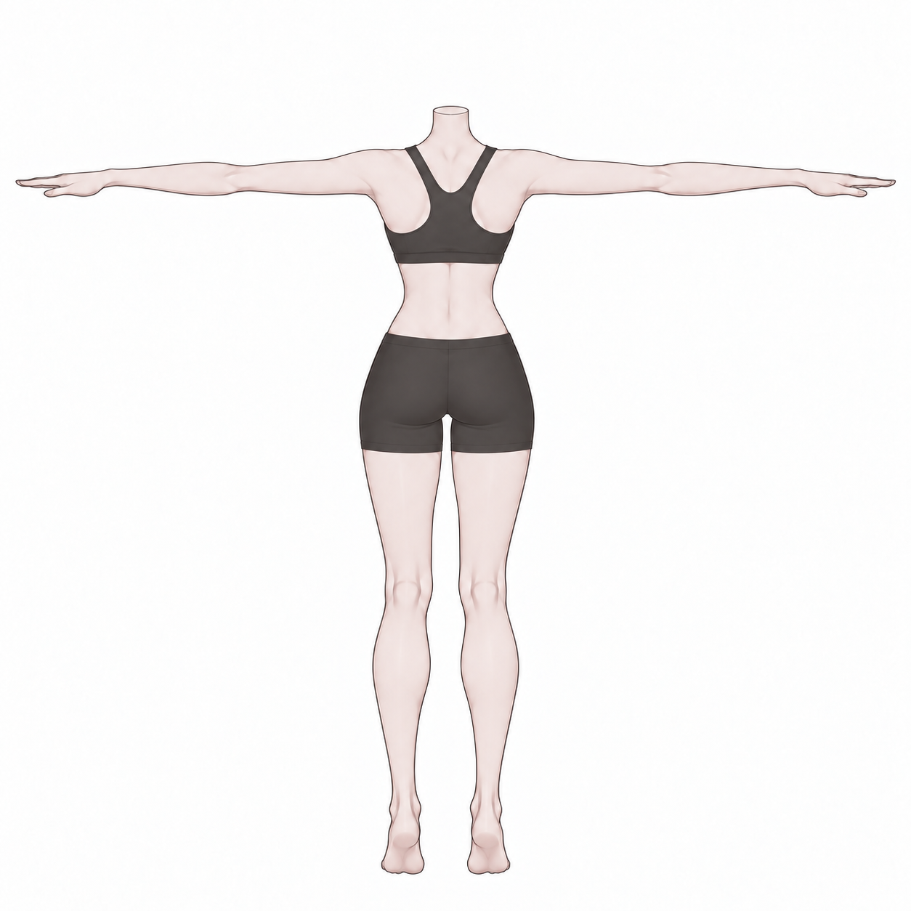

# v007 · 머리·몸 분리 제작용 4방향

2026-09-15 · 생성 이미지 참고안

사용자의 얼굴·몸 분리 제작 검토에 이어, **머리 4장 + 몸 4장**을 방향별 PNG로 제작했다. 각 세트의 순서는 정면·오른쪽·왼쪽·뒤다. 몸은 속옷형 T 포즈이며, 머리는 얼굴과 두상 확인을 위해 헤어를 숨긴 확대본이다. 정돈한 긴 웨이브 헤어 디자인은 [v005](../v005_groomed_underwear/README.md)에 별도 참고로 유지한다.

**[개별 PNG 8장 ZIP 다운로드](v007_HEAD_BODY_INPUTS.zip)** · [분리 제작 설계안](../v006_head_body_separation/README.md)

## 머리 — 두상·얼굴·귀·목 윗부분

| 정면 | 오른쪽 | 왼쪽 | 뒤 |
|---|---|---|---|
|  |  |  |  |

원화의 성인 캐릭터 얼굴과 v005를 참조했다. 제작용으로만 머리카락을 숨겨 양눈·눈썹·귀·턱·두상이 드러나게 하고, 입을 다문 중립 표정으로 구성했다. 원화에서 앞머리에 가려졌던 눈과 두상의 보이지 않는 부분은 추정안이다. 새로운 대머리 캐릭터 디자인을 채택한 것이 아니다.

## 몸 — 머리 없는 속옷형 T 포즈

| 정면 | 오른쪽 | 왼쪽 | 뒤 |
|---|---|---|---|
|  |  |  |  |

기존의 불투명 스포츠 브라·피트 쇼츠·맨발을 기준으로 머리와 헤어를 분리했다. 목 윗단은 아바타 파츠를 조립하기 위한 매끈한 마감으로 표현했다. 팔은 수평 T 포즈이며, 측면에서는 카메라 쪽으로 향한 팔과 손이 어깨 높이에 겹쳐 보인다.

## 팔 길이 지적 — 정면·후면 수정 비교

처음 정면 그림은 좌우 대칭이 아니었다. 사용자 지적 후 정면과 후면을 내장 ImageGen으로 각각 수정했다. 아래 수치는 **목 중앙에서 화면 양쪽 손끝까지의 가로 거리**이며, 어깨 관절부터 잰 실제 팔 길이가 아니다.

| 그림 | 화면 왼쪽 거리 | 화면 오른쪽 거리 | 좌우 차이 |
|---|---:|---:|---:|
| 정면 수정 전 | 592.5px | 611.5px | 19px |
| 정면 수정 후 | 602.5px | 606.5px | 4px |
| 후면 수정 전 | 599.5px | 611.5px | 12px |
| 후면 수정 후 | 603.5px | 607.5px | 4px |

| 정면 수정 전 | 정면 수정 후 |
|---|---|
|  |  |

| 후면 수정 전 | 후면 수정 후 |
|---|---|
|  |  |

1254×1254 원본에서 RGB 최솟값이 210보다 작은 픽셀을 윤곽으로 보고, y=155·160·165 행 윤곽 중점의 중앙값을 목 중심으로 삼았다. 손끝은 y=200–289 구간의 좌우 최외곽이다(좌표는 0부터). 수치는 이 기준의 재현 가능한 2D 측정값이다. 잔여 차이 4px가 있으므로 **완전 대칭·동일 팔 길이 검증 완료로 판정하지 않는다.** 상완·전완·손의 실제 길이는 3D 제작 시 좌우 대칭 형상과 동일한 본 길이로 맞춰야 한다. 측면은 초기 정면을 참조해 생성했으며, 정면 수정 후 3D 좌표 정합을 다시 계산한 결과가 아니다.

## 파일 사용

ZIP의 `head/`에는 머리 네 방향, `body/`에는 몸 네 방향이 있다. 각 폴더마다 `front.png`, `right.png`, `left.png`, `back.png`를 사용한다. 머리 정면에 몸 측면을 섞어 하나의 4방향 세트로 넣지 않는다.

오른쪽/왼쪽은 캐릭터 본인의 기준이다. `right.png`는 코 또는 몸의 앞쪽과 발끝이 화면 오른쪽을, `left.png`는 화면 왼쪽을 향한다. 이 갤러리의 표시 순서를 서비스 API의 위치 배열 순서로 간주하지 않는다.

머리는 세부 확인을 위해 몸과 다른 배율로 확대했다. 그림의 목 마감은 연결 위치를 위한 개념 표현이며, 서로 맞물리는 단면 치수·정점·UV·웨이트를 정의한 설계 도면은 아니다. 실제 모델 조립 시 머리 크기·목 길이·연결 단면과 피부색을 맞춰야 한다.

이 묶음은 **이미지 입력 후보**다. 머리 없는 몸을 Tripo가 원하는 방식으로 생성·자동 리깅하는지, 얼굴에 눈꺼풀·입 안·표정용 면 구성이 만들어지는지는 아직 확인하지 않았다. 실제 작업에서 전체 몸의 임시 머리가 필요할 가능성도 있으므로 자동 리깅 호환성을 보장하지 않는다.

## 제작·확인

내장 ImageGen으로 머리와 몸의 정면을 각각 먼저 만든 뒤, 각 정면을 참조해 양측면·후면을 생성했다. 파츠와 방향마다 한 장씩 생성했으며 그림을 잘라 나누거나 단순 좌우 반전하지 않았다. 최종 이미지는 직접 확인했다. PNG 8장은 모두 1254×1254이며 ZIP의 8항목 CRC와 원본 바이트 일치를 확인했다. 전체 프롬프트(`prompts/`), 읽기 전용 픽셀 측정 스크립트와 생성 기록은 작업 저장소에 보존한다. ZIP에는 수정 후 입력 8장만 넣었다.

프롬프트 요약: “비앙카의 성인 얼굴 인상과 체형을 기준으로, 헤어 없는 머리·귀·목 파츠와 머리 없는 속옷형 T 포즈 몸을 별도로 그린다. 정면·양측면·뒤를 흰 배경의 개별 이미지로 만들고, 같은 세트의 형태와 높이를 맞춘다. 측면의 팔은 카메라 방향으로 겹치며 후면에는 정확한 뒤쪽 구조를 표현한다.”

AI 생성 그림이므로 방향마다 얼굴 깊이·체형·목 마감·손 표현에 차이가 남을 수 있다. 실제 3D 모델의 동일 좌표계 직교 렌더나 표정·리깅 검수 결과가 아니다. 기존 Bianca 모델·v005/v006 자료는 보존했고, 이번에는 모델 생성·절단·대체나 Blender/Unity 편집을 실행하지 않았다.
