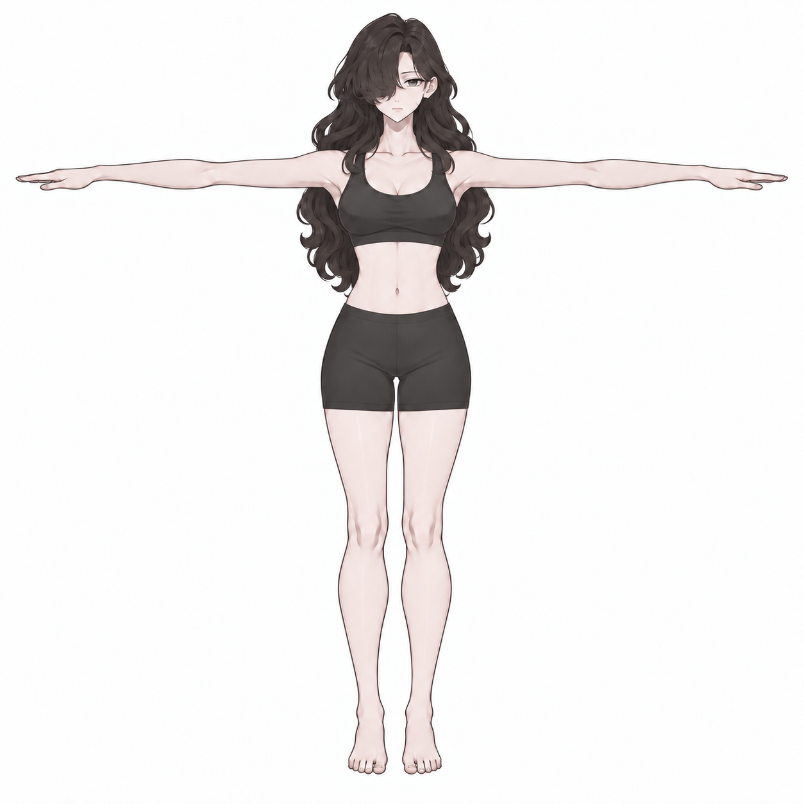
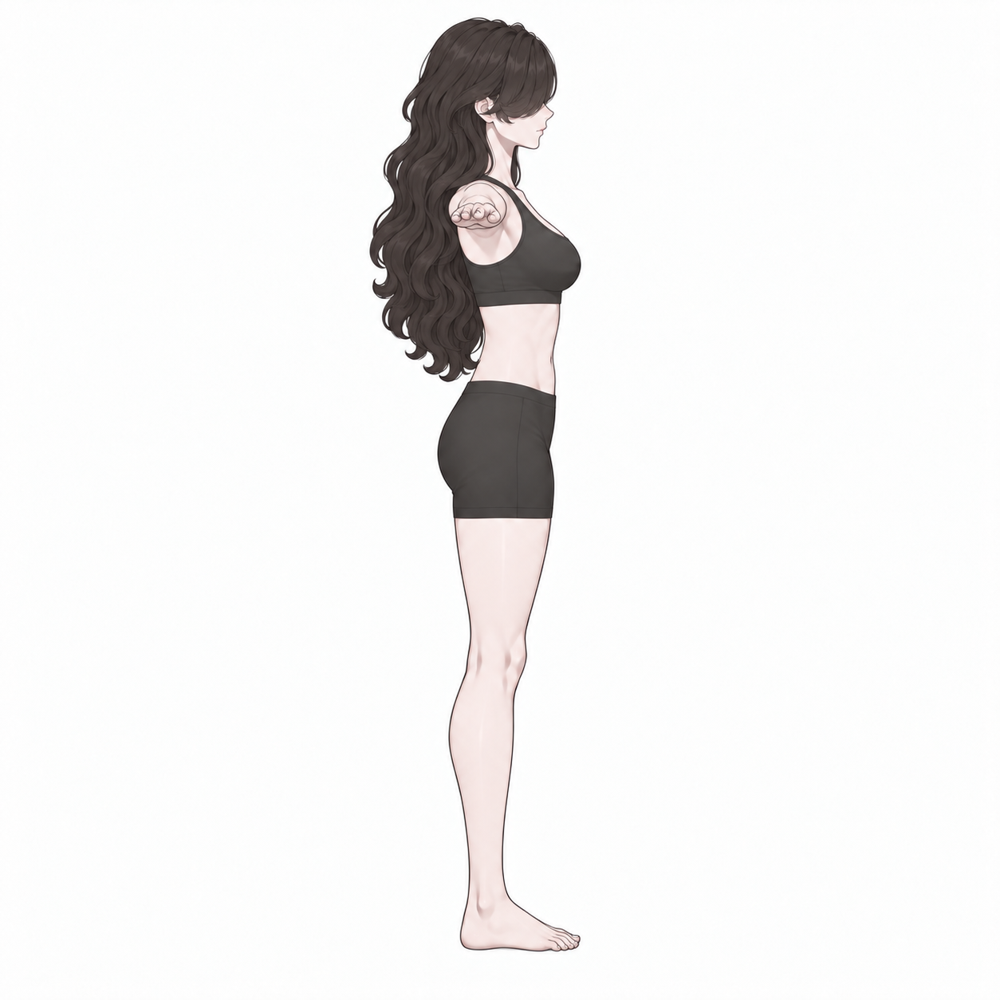
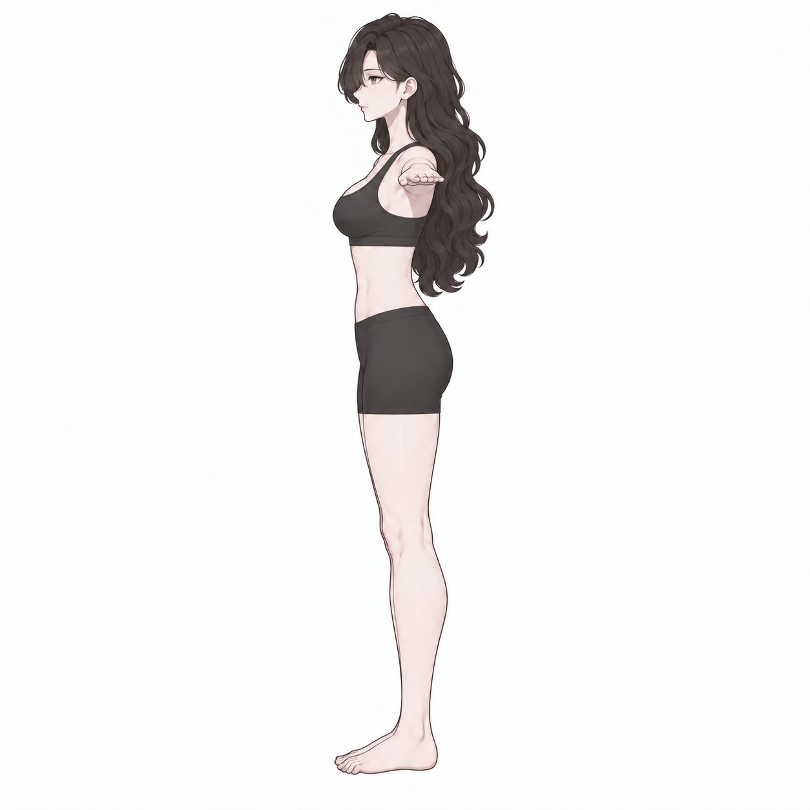
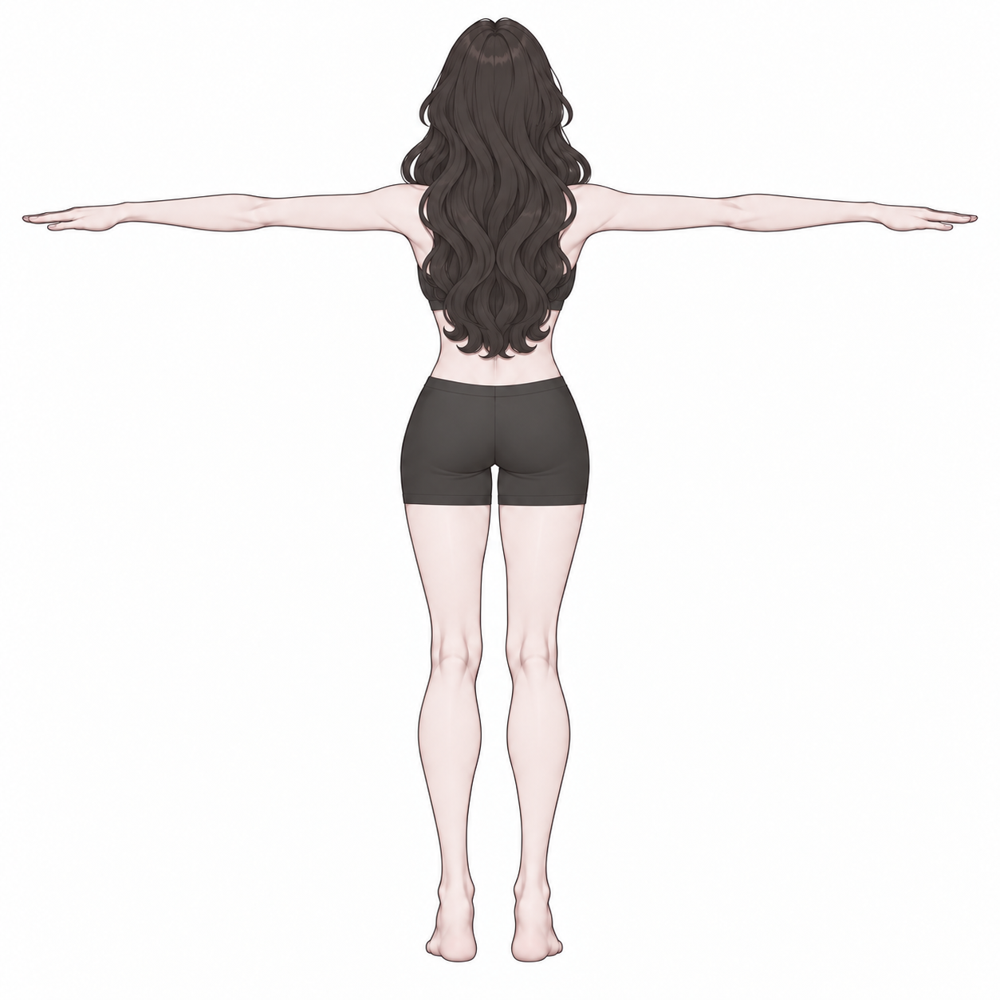

# v008 · 170cm 설정 · 헤어 포함 전신 사면도

2026-09-15 · 모델 제작용 생성 참고안

사용자 요청에 따라 **머리와 정돈한 긴 웨이브 헤어를 포함한 전신**을 정면·오른쪽·왼쪽·뒤의 개별 PNG로 제작했다. 몸은 불투명 스포츠 브라와 피트 쇼츠, 맨발 T 포즈다. v007의 분리 파츠와 별도로 전체 실루엣을 확인하는 자료다.

**[4방향 PNG ZIP](v008_170CM_INPUTS.zip)**

| 정면 | 오른쪽 | 왼쪽 | 뒤 |
|---|---|---|---|
|  |  |  |  |

## 170cm의 기준

키는 **맨발 바닥에서 해부학적 정수리까지 170cm(1.70m)**로 설정한다. 머리카락의 두께와 신발 높이는 키에 포함하지 않는다. 머리카락 최상단은 170cm보다 높을 수 있다.

PNG 자체에 실제 미터 단위가 저장되어 있는 것은 아니다. 3D 제작 시 바닥을 높이 0으로 두고, 머리카락을 숨긴 두상의 정수리를 1.70m에 맞춘다. 생성된 모델 높이가 H미터라면 전체 배율은 1.70/H를 기준으로 조절하며, 몸·머리·헤어를 같은 배율로 맞춘다. 머리카락 끝까지의 바운딩 박스를 키로 사용하지 않는다. 이번에는 이미지 제작만 수행했으며 실제 모델 크기는 아직 변경하지 않았다.

## 헤어와 방향

v005의 정돈한 긴 웨이브를 기준으로 잔머리와 밖으로 뻗는 가닥을 억제했다. 앞머리는 캐릭터 본인의 오른쪽 눈을 덮는다. 오른쪽 측면은 코·발끝이 화면 오른쪽을 향하고, 왼쪽 측면은 화면 왼쪽을 향한다. 비대칭 앞머리 때문에 단순 좌우 반전으로 만들지 않았다.

T 포즈의 측면에서는 카메라를 향하는 팔이 짧게 겹쳐 보이며 손이 어깨 높이에 나타난다. 이는 A 포즈로 팔을 내린 표현과 다르다. 후면은 얼굴 없이 뒤쪽 헤어 덩어리와 뒤꿈치가 보이는 방향이다.

전체 캐릭터 입력에는 헤어가 포함되어 있지만, 이 그림만으로 자동 생성되는 머리카락이 독립 메시가 된다고 보장하지는 않는다. 헤어 별도 파츠 제작에는 두상에 맞춘 추가 분리 작업이 필요하다. [v007 머리·몸 분리 참고](../v007_head_body_four_views/README.md)는 그대로 보존한다.

## 제작·검수

내장 ImageGen으로 정면을 먼저 제작하고 몸 중심·양팔 대칭을 수정한 뒤, 수정 정면을 참조해 세 방향을 생성했다. 후면은 v005의 뒤쪽 헤어 디자인도 참조했다. 전체 프롬프트는 작업 저장소 `prompts/`에 보존했다. 프롬프트 핵심은 “성인 비앙카, 맨발 정수리 기준 170cm, 정돈한 헤어, 속옷형 수평 T 포즈, 동일 체형·높이, 정확한 네 방향, 흰 배경”이다.

네 방향을 직접 확인하되, AI 생성 그림의 팔 대칭·관절 위치·방향 간 체형이 수학적으로 일치한다는 판정은 하지 않는다. 170cm는 사용자 지정 제작 목표이며 그림에서 실측 인증한 키가 아니다. 3D에서 동일 좌표계로 렌더한 정밀 도면·Tripo 생성·리깅 검수 결과와 구분한다. 기존 모델과 Blender/Unity 작업 중단 상태는 유지했다.

파일 검증: PNG 4장 모두 1254×1254, ZIP 4항목의 CRC와 원본 바이트 일치 확인. RGB 최솟값<210의 보이는 전체 윤곽 기준 상단/하단 y는 정면20/1207, 오른쪽22/1193, 왼쪽20/1199, 뒤22/1206이다. 바닥선에 최대14px 차이가 남으며, 헤어 길이·옆모습 두께·손 표현도 미세하게 달라 정밀 정합 완료로 보지 않는다. 이 윤곽 높이는 헤어를 포함하므로 170cm 실측값으로 환산하지 않았다.
