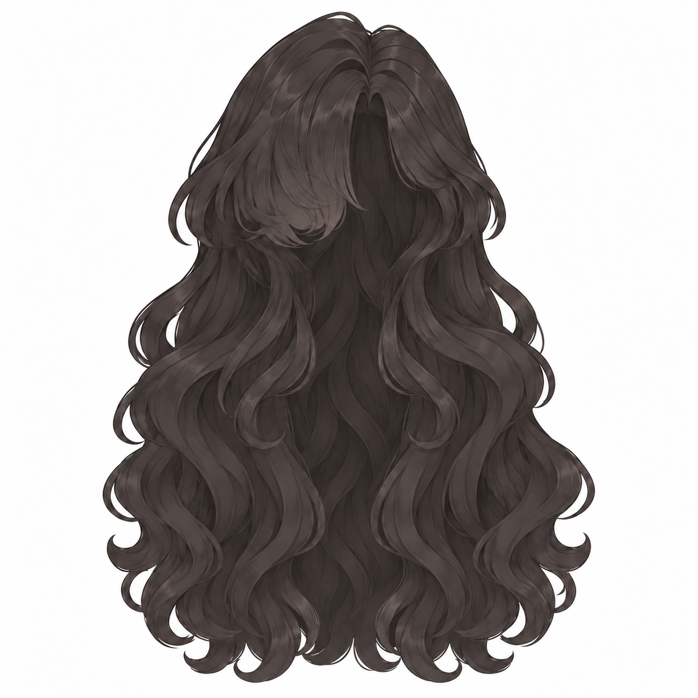
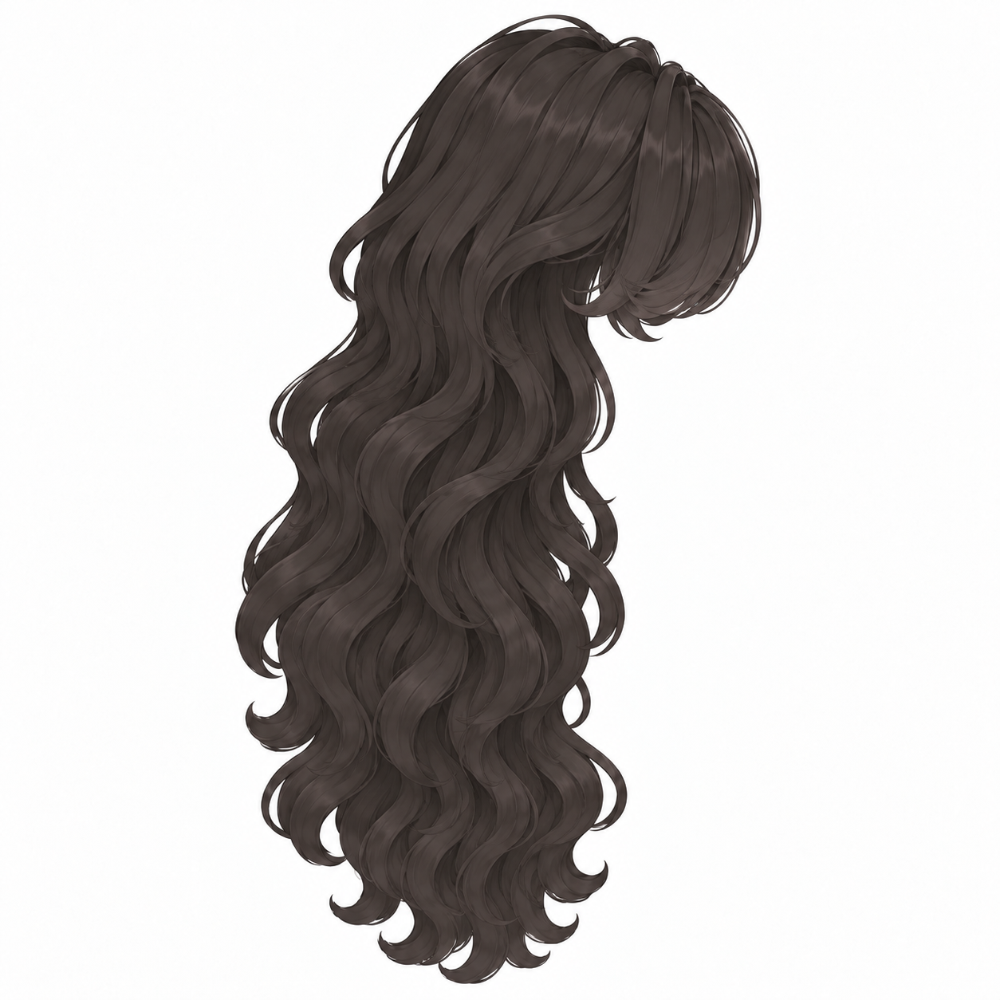
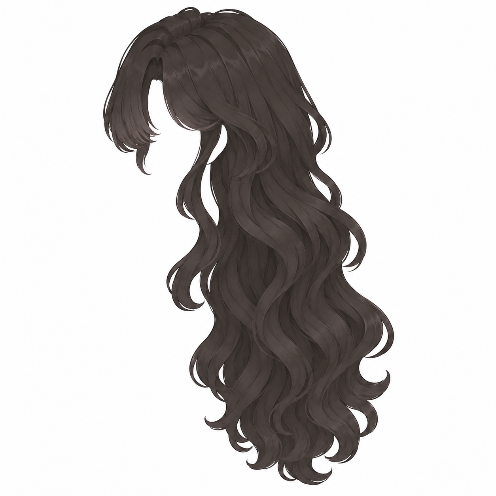
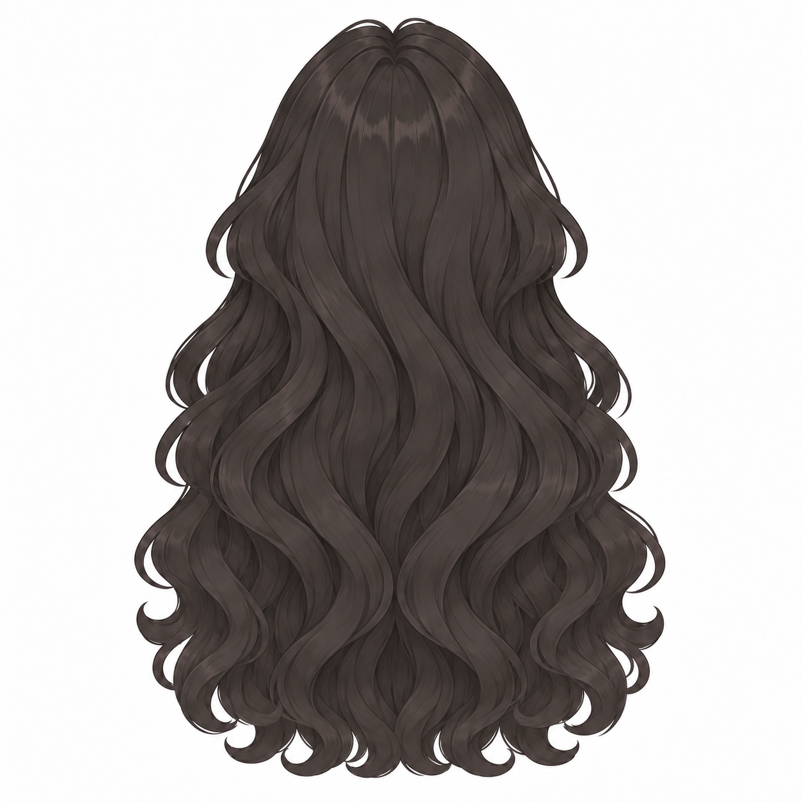

# v009 · 헤어 단독 사면도와 머리·몸 쿼드 예산

2026-09-15 · 생성 참고안 / 첫 리토폴로지 설정 제안

**첫 시험값은 머리 6,000쿼드, 몸 10,000쿼드, 헤어 6,000쿼드를 추천한다.** 아래 수치는 비앙카의 분리 제작을 위한 작업 판단이며, Tripo 공식 권장값이나 실제 생성 결과의 검증된 최적값이 아니다. 키 170cm 자체가 면 수를 결정하지 않는다.

## 헤어 단독 4방향

**[헤어 PNG 4장 ZIP](v009_HAIR_INPUTS.zip)** · [170cm 전신 기준](../v008_170cm_hair_turnaround/README.md)

| 정면 | 오른쪽 | 왼쪽 | 뒤 |
|---|---|---|---|
|  |  |  |  |

얼굴·귀·목·몸·옷 없이 헤어만 남긴 확대 이미지다. 정돈한 긴 웨이브와 본인 오른쪽 눈을 덮는 앞머리를 유지했다. 오른쪽은 가상의 얼굴이 화면 오른쪽을, 왼쪽은 화면 왼쪽을 향한다. 양측면은 단순 좌우 반전이 아니다.

초기 정면은 뒤쪽 머리카락이 빠져 중앙에 길게 흰 틈이 생겼다. 최종 정면에는 앞머리와 옆머리 뒤로 보이는 후면 헤어층을 보완했다. 중앙의 어두운 부분은 얼굴이나 두상이 아니라 뒤에 있는 머리카락이다. 생성 모델에서는 이 영역이 막힌 덩어리로 해석될 수 있으므로 두상에 씌울 내부 공간과 앞·뒤 레이어를 확인해야 한다.

머리카락을 확대해서 그렸으므로 전신 이미지와 픽셀 배율은 다르다. 170cm 몸에 조립할 때 확정한 두상의 정수리·관자놀이·뒤통수에 맞춰 크기를 정하고, 끝이 허리 부근에 오도록 조절한다. 헤어 자체 높이를 170cm로 설정하지 않는다. 방향별 깊이·컬 위치·길이는 생성 추정이며 동일 3D 메시의 렌더가 아니다. 독립 메시·빈 내부·두상 피팅·물리본은 아직 제작하지 않았다.

## 실제 입력할 쿼드 수

| 파츠 | 첫 목표값 | 비교 범위 | 포함 범위·배분 의도 |
|---|---:|---:|---|
| **머리** | **6,000** | 4,000–8,000 | 얼굴 피부·두상·귀·목 윗부분. 헤어 제외. 눈꺼풀·입술·귀·턱 윤곽에 우선 배분 |
| **몸** | **10,000** | 8,000–10,000 | 목 아래 몸통·양팔·손가락·양다리·발. 머리·헤어·정장 제외. 관절과 손을 우선 보호 |
| 헤어 | 6,000 | 4,000–8,000 | 앞머리·옆머리·뒷머리 전체 합계. 컬 실루엣과 움직일 가닥 묶음에 배분 |

몸 입력에 스포츠 브라·쇼츠가 포함되어 있으므로, 생성 결과에서 이 부분이 몸과 합쳐졌는지 또는 별도 면으로 나왔는지 확인한다. 별도 의상층으로 생성되었다면 그 면도 10,000 예산에 포함된다. 안구·치아·혀·속눈썹을 나중에 따로 제작하면 별도 예산이 추가된다. 좌우 한쪽당 수량이 아니라 각 파츠 전체 수량이다.

Tripo의 **Smart Retopology v2.0 API**는 `quad`를 쿼드 출력 선택으로, `face_limit`를 목표 폴리곤 수로 설명하며 쿼드 범위는 500–10,000이다. 따라서 현재 제안값은 이 범위 안에 둔다. Studio 화면의 모든 생성 모드가 같은 범위라고 단정하지 않는다. Quad 모드의 목표 Faces/Polycount 입력을 기준으로 하며, 결과 통계가 삼각형 수인지도 확인한다. [Tripo Retopology 공식 문서](https://developers.tripo3d.ai/en/docs/mesh-decimate).

**쿼드 1개는 삼각형으로 분할하면 2개**다. 전부 쿼드라면 머리6,000+몸10,000+헤어6,000=22,000쿼드, 약44,000삼각형이다. 혼합 면·추가 파츠·Modifier 적용 후에는 실제 수가 달라진다. GLTF/STL은 쿼드를 저장하지 않고 삼각형으로 저장한다는 Tripo 안내가 있으므로, 편집용 쿼드를 보존하려면 제공되는 FBX/OBJ를 받고 Blender에서 사각형 면이 남았는지 확인한다. GLB도 glTF 계열이므로 표시 수를 곧바로 쿼드 수로 해석하지 않는다. [Tripo 변환 공식 문서](https://docs.tripo3d.ai/export/conversion.html).

이 예산은 현재의 PC용 아바타 제작 시험을 가정한다. VRChat은 삼각형 수와 재질·본·PhysBones 등 여러 항목으로 평가하며, 비활성 오브젝트도 집계한다. 옷을 나중에 더할 여유를 남겨야 하고, 쿼드 합계만으로 성능 등급을 확정할 수 없다. 모바일 최적화 예산으로 제안한 수치가 아니다. [VRChat Performance Ranks](https://creators.vrchat.com/avatars/avatar-performance-ranking-system/).

## 개수보다 먼저 볼 것

- **머리:** 눈둘레·입둘레가 닫히는 루프, 눈꺼풀 두께, 안구와의 관계, 입 안 공간. 깜박임·입 벌림에 실패하면 면 수 증량보다 면 흐름 수정이 우선이다.
- **몸:** 어깨·팔꿈치·골반·무릎 주변의 면 분포, 손가락 분리, 좌우 길이와 목 연결. 10,000으로도 손이 붙어 나오면 단순 증량으로 해결된다고 보지 않는다.
- **헤어:** 앞머리와 뒷머리 레이어, 내부 공간, 두상 관통, 가닥 묶음 사이 연결. 작은 홈은 텍스처로 표현하고 큰 컬의 윤곽에 기하를 배분하는 방향을 권한다.

처음에는 위 목표값으로 한 번 생성·내보내기를 확인한 뒤 필요한 부위만 보완한다. 모든 면이 쿼드라는 사실만으로 표정·관절 변형에 적합한 토폴로지가 되지는 않는다. 이 권장값으로 Tripo 생성이나 리깅을 실행한 것은 아니다.

## 제작 기록

내장 ImageGen 사용. v008 착장 전신을 헤어 디자인·방향 참고로 삼아 단독 정면을 만든 후, 빠진 후면층을 보완하고 수정 정면을 기준으로 세 방향을 생성했다. 프롬프트 요약: “정돈한 비앙카 긴 웨이브, 얼굴·몸 없는 완전한 헤어 파츠, 비대칭 앞머리 유지, 정면·양측면·후면의 개별 흰 배경 이미지.” 전체 프롬프트와 원본 기록은 작업 저장소에 보존한다. 기존 모델 편집·Tripo 실행·Blender/Unity 실행은 하지 않았다.

최종 PNG 네 방향을 직접 확인했다. 네 파일 모두 1254×1254이며, ZIP 4항목의 CRC와 원본 바이트 일치를 확인했다. 머리카락의 보이는 상단/하단은 정면21/1226, 오른쪽18/1233, 왼쪽17/1226, 뒤28/1216px로 미세한 배율·끝 위치 차이가 남는다. 같은 두상에 맞춘 정밀 피팅 검증은 아니다.
