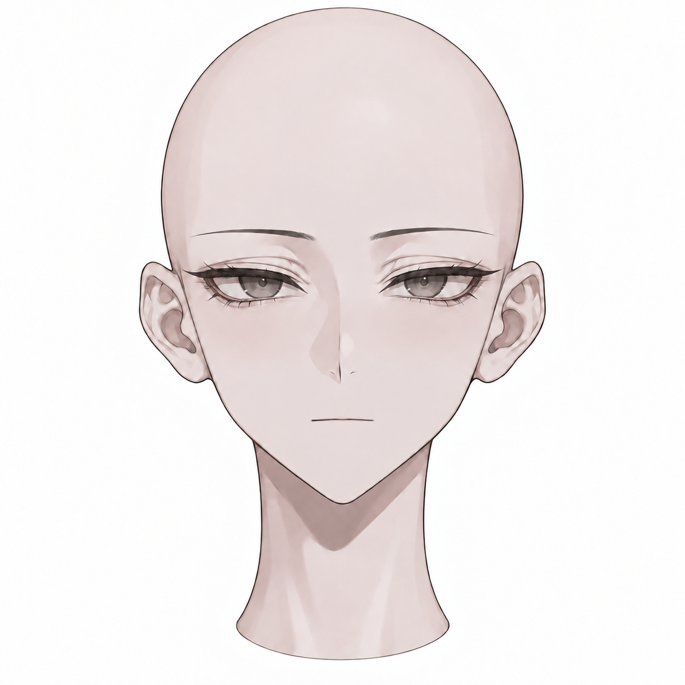
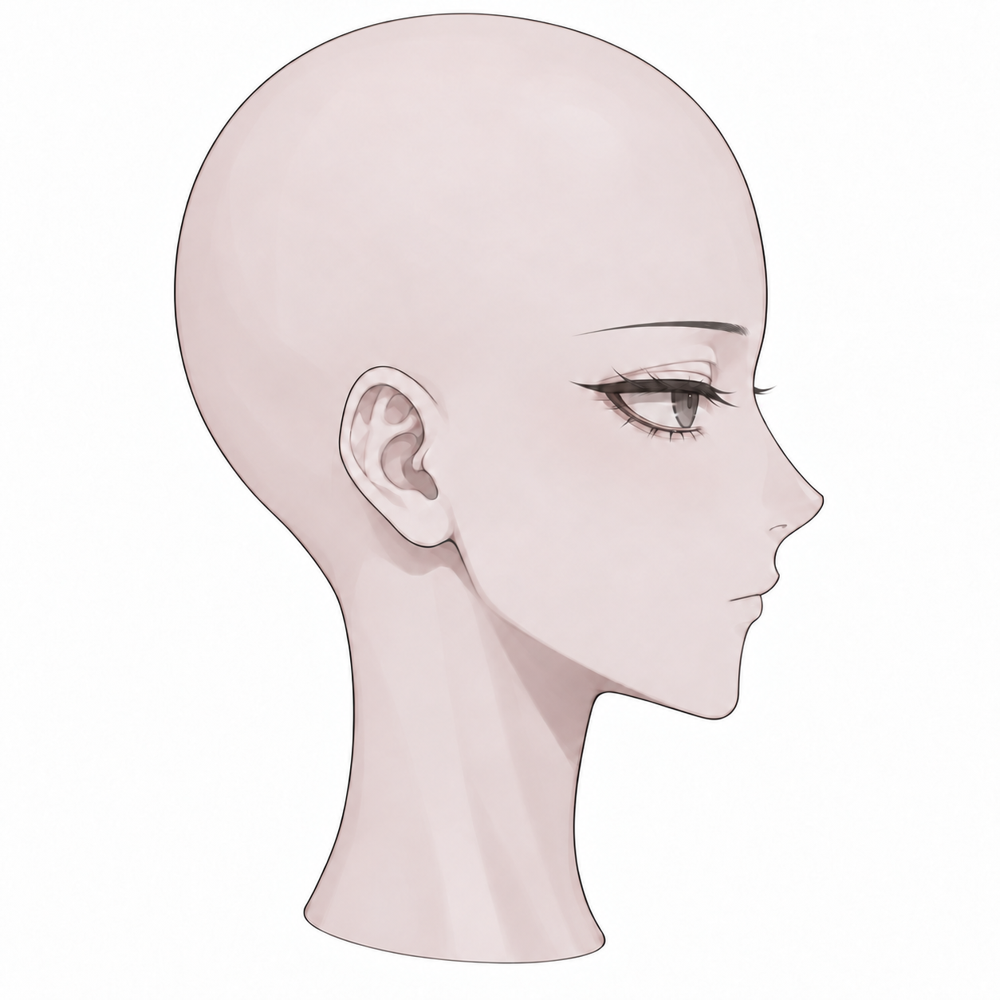
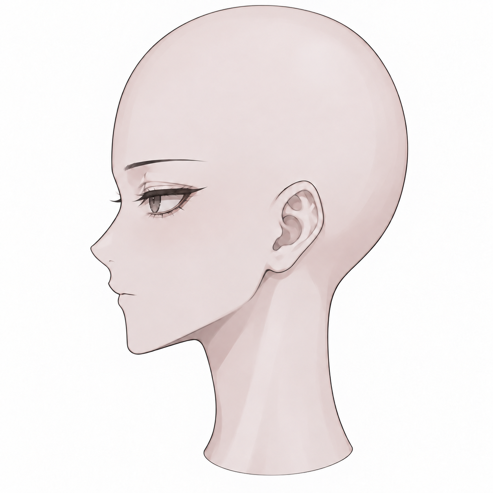
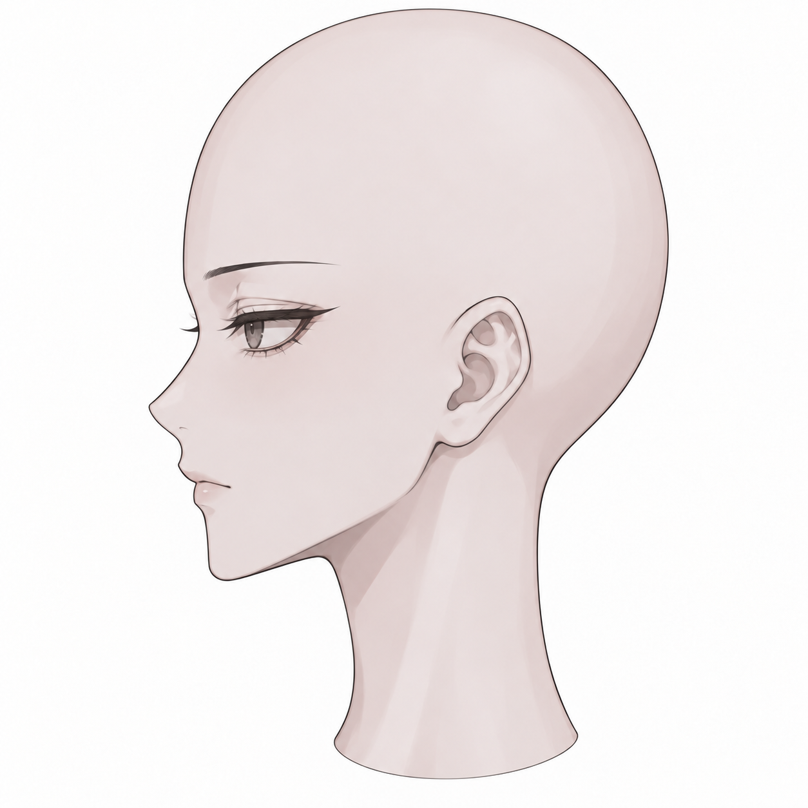

# v010 · 머리 단독 이미지 입술 강조 완화

2026-09-15 · 입력 이미지 수정 후보

사용자가 머리 단독 생성 결과의 입술이 강조된다고 지적했고, 이어 와이어프레임 정면 사진을 제공했다. 사진에서는 윗입술의 봉긋한 윤곽과 두꺼운 아랫입술 영역이 강조되어 보인다. 정면 사진만으로 실제 돌출 깊이나 면 간 거리를 측정할 수는 없다. 이번에는 v007 머리 입력 그림의 입술 색·광택·두께 표현을 줄였다. **첨부된 3D 모델 파일을 수정한 결과는 아니다.**

**[수정 머리 사면도 PNG ZIP](v010_HEAD_INPUTS.zip)**

## 입력 사면도

| 정면 | 오른쪽 | 왼쪽 | 뒤 |
|---|---|---|---|
|  |  |  |  |

정면·양측면은 수정본이다. 입술이 보이지 않는 뒤쪽은 v007 원본을 그대로 복사했다. ZIP의 네 파일은 모두 1254×1254이며 CRC·원본 바이트 일치를 확인했다.

## 수정 전후

| 방향 | v007 수정 전 | v010 수정 후 |
|---|---|---|
| 정면 |  |  |
| 오른쪽 |  |  |
| 왼쪽 |  |  |

정면은 입술 중앙의 흰 광택, 아랫입술의 타원형 음영, 도드라진 윗입술 산을 없애고 얇은 닫힌 입선으로 정리했다. 초기 수정에서도 광택과 아랫입술 음영이 남아 한 번 더 수정했다. 양측면은 입술 색과 반짝임을 없애고 입선을 짧게 했으며 아랫입술의 둥근 돌출 표현을 완화했다. 오른쪽은 첫 수정이 약해 추가로 조절했다. 측면의 입술 굴곡은 일부 남아 있으며, 3D 입술 두께·부피가 일정 비율로 감소했다는 수치 판정은 하지 않는다.

원화의 작은 입 표현을 스타일 기준으로 삼았고, 기존 눈·눈썹·코·두상·귀·턱·목과 중립 표정을 최대한 유지하도록 요청했다. 생성 편집이므로 입 바깥 모든 픽셀이 정확히 보존된 것은 아니다. 완성본 세 방향을 직접 확인했으나, 사용자 최종 채택이나 얼굴 전체의 형태 정합 검증으로 확대하지 않는다.

## 모델 결과와 구분

이 이미지는 Tripo가 강한 입술 광택·음영을 두꺼운 형태로 해석할 가능성을 줄이기 위한 입력 후보다. 사용자의 모델에서 해당 해석이 실제 원인이었다고 확정하지 않으며, 새 입력만으로 입술 부피 문제가 해결된다고 보장하지 않는다. 새 결과에서도 입술이 두껍다면 기존 생성 메시의 입술 표면·돌출·입 안 경계를 직접 조절하는 단계가 필요하다. 이때 표정용 눈·입 루프는 단순히 면 수를 줄이는 것과 별도로 다룬다.

머리 6,000쿼드의 첫 시험 예산은 이번 피드백만으로 변경하지 않는다. 문제는 총 쿼드 수보다 현재 입술 형태의 강조로 관찰된다. 실제 메시·블렌드셰이프·입 안 구조는 아직 검사하지 않았다. 착용자 키170cm 기준, v007 몸·v009 헤어는 유지한다.

## 제작 기록

내장 ImageGen으로 v007 정면·양측면을 각각 편집했고, 원화는 입 표현 참고로만 사용했다. 프롬프트 핵심: “성인 비앙카의 기존 얼굴을 유지하며 입술의 색·광택·아랫입술 음영을 제거하고 얇은 중립 입선과 낮은 측면 돌출로 조절.” 전체 프롬프트·파일 기록·사용자 피드백 사진은 작업 저장소에 보존한다. 공개 문서에는 생성 입력의 전후 비교만 포함한다. Blender/Unity 실행·기존 모델 메시 수정·Tripo 재생성은 수행하지 않았다.
