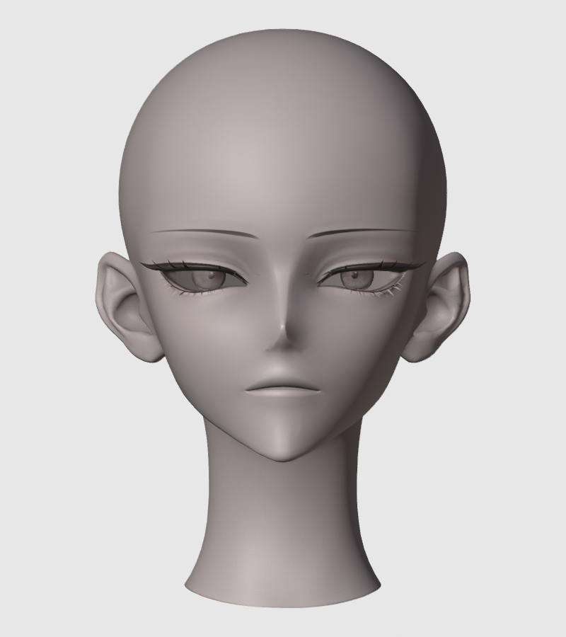
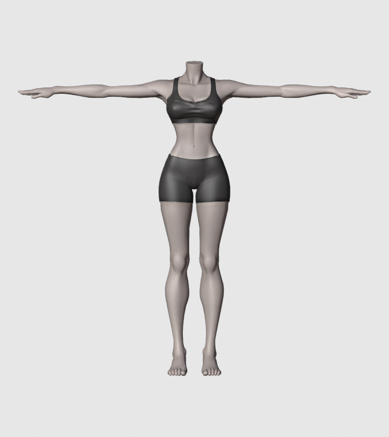
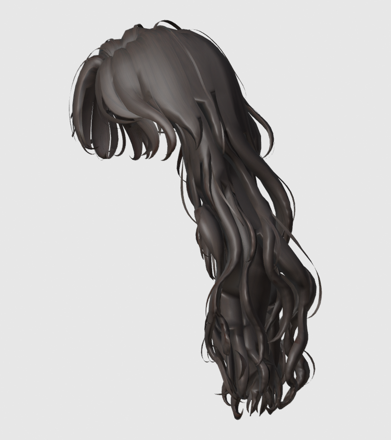
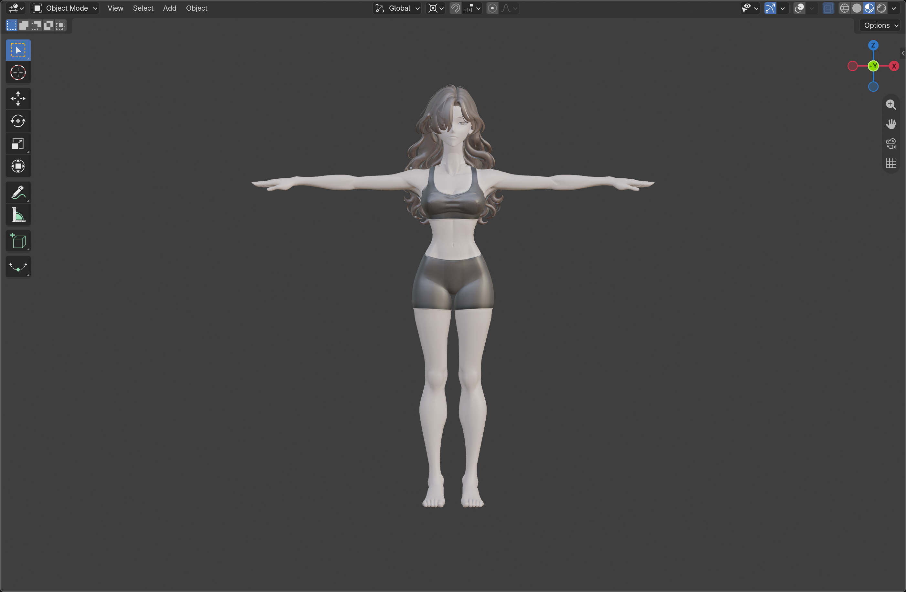
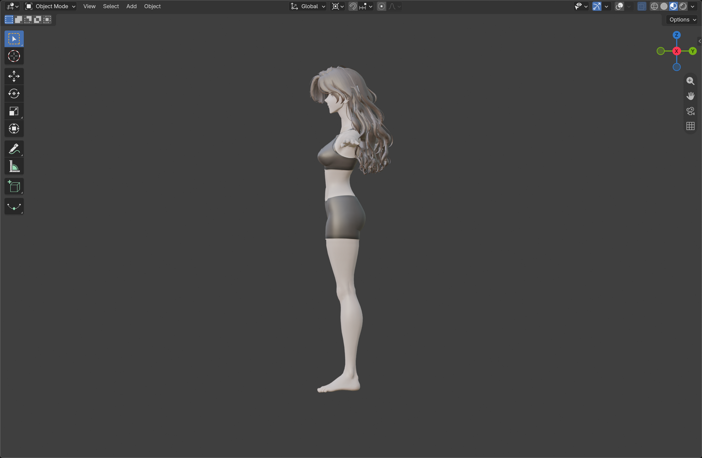
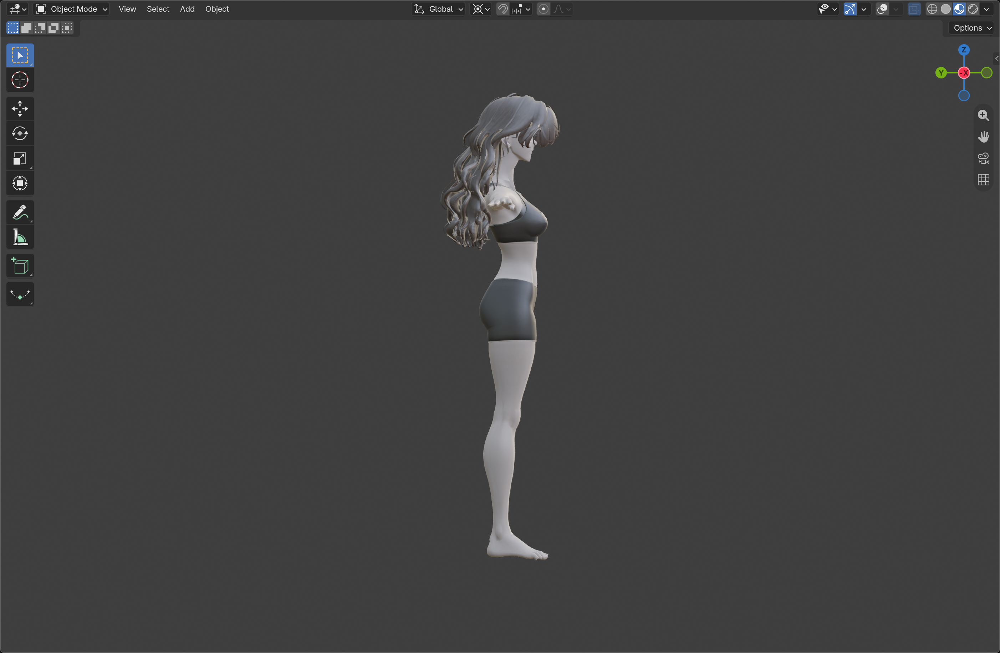
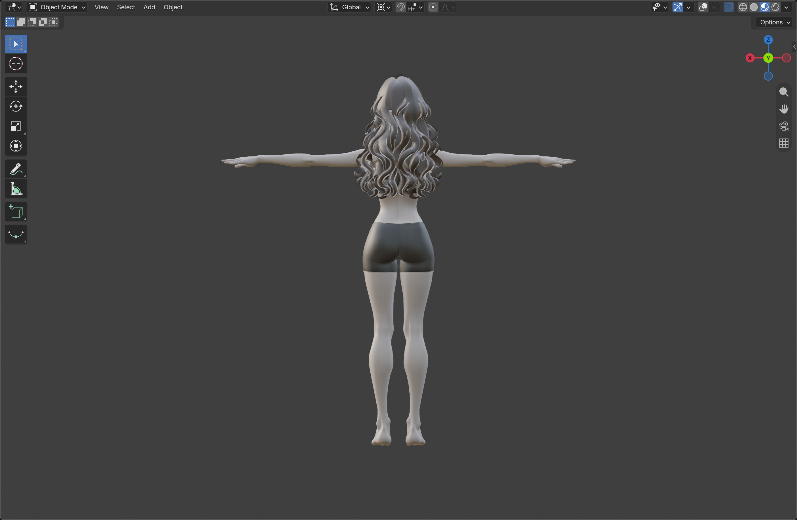
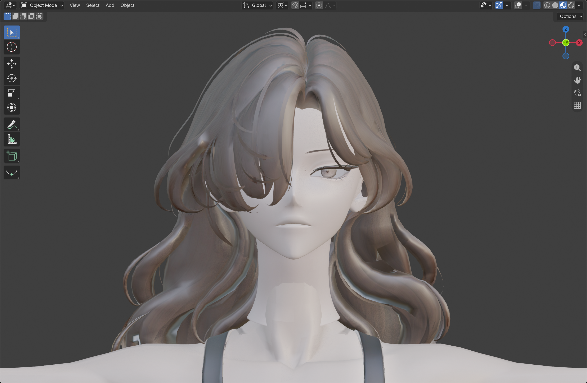
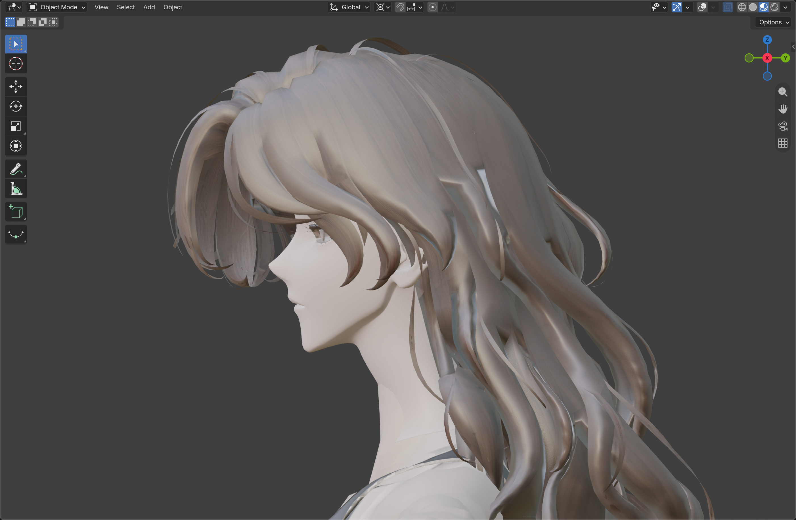

# v011 · Tripo 머리·몸·헤어 조립 검수

2026-09-15. 다운로드한 세 FBX를 **170cm T 포즈의 별도 조립 검수본**으로 맞췄다. 사용자 요청에 따라 배치·스케일·목 주변 편집·저장·재열기는 Blender 화면을 Computer Use로 직접 조작했다. 초기 압축 해제·가져오기와 원시 렌더는 방식 정정 전 수행했고, 최종 수치 검사는 모델을 수정하지 않는 읽기 전용 검사다.

**완료 범위는 세 파츠의 정적 조립과 검수다. 목 봉합·재질 통일·헤어 관통 정리·리깅이 끝난 실사용 아바타는 아니다.** 기존 v354 작업 중단과 채택 상태는 변경하지 않는다.

## 조립 전 입력 파츠

| 머리 원시 입력 | 몸 원시 입력 | 헤어 원시 입력 |
|---|---|---|
|  |  |  |

다운로드한 실제 메시의 조립 전 렌더다. 각 파츠를 화면에 맞춰 따로 촬영했으므로 그림 크기는 서로의 실제 배율을 뜻하지 않는다. 원시 사진은 Workbench, 아래 조립 사진은 Material Preview이므로 색·광택의 차이를 텍스처 개선으로 비교하면 안 된다. 배율·배치·목 피팅은 변경했으며 기본색 텍스처는 새로 채색하지 않았다.

## 결과 사진

아래는 생성 그림이 아니라 저장한 조립본을 실제 Blender에서 다시 열고 촬영한 Material Preview 화면이다. 정면·양측면·후면에서 배치와 실루엣을 직접 확인했다.

몸은 속옷형 T 포즈다. 손끝 간 폭은 약164.92cm이며 이번에 팔이나 다리의 국소 형상을 수정하지 않았다. 이 폭이 어깨 관절 기준 팔 길이의 완전 대칭을 증명하지는 않는다.

| 오른쪽 측면 | 왼쪽 측면 |
|---|---|
|  |  |

양측면에서 머리와 몸의 깊이를 맞췄다. 헤어 일부가 어깨 근처에 겹쳐 보이며, 앞머리의 두께와 뜬 가닥은 추가 정리가 필요하다.

초기 피팅에서는 큰 후두부가 머리카락 밖으로 드러났다. 헤어 깊이와 너비를 조절하고 뒤로 이동해 이 큰 노출을 줄였다. 모든 헤어 내부 교차를 해결했다는 판정은 아니다.

## 목과 헤어의 잔여 문제

목 아래의 큰 돌출은 줄였지만 **머리와 몸이 겹치는 경계, 색·음영 차이, 일부 각진 면이 명확히 남는다.** 두 메시를 용접하지 않았고 내부 목 마개도 제거하지 않았다. 현재처럼 겹쳐 끼운 방식은 조립 비율 검수용이다. 실사용 전에는 접합 높이를 정하고 경계 고리를 연결하거나, 분리 구조를 유지할 경우 일치하는 경계 형상·노멀·피부 재질을 만들어야 한다.

헤어에는 넓은 연결면, 정수리의 거친 단차, 얇게 뜬 가닥과 밝은 틈이 보인다. 현재의 세 파츠는 독립 생성물이므로 동일 두상을 전제로 정확히 맞는 키트가 아니다. 단순 합치기만으로 최종 품질이 나오지 않는다는 점을 확인했다. 입술의 실제 형상을 새로 다듬은 작업도 아니다.

## 입력과 실제 메시 수

| 파츠 | 정점 | 쿼드 | 삼각형 | 총 면 |
|---|---:|---:|---:|---:|
| 머리 | 9,372 | 5,913 | 538 | 6,451 |
| 몸 | 18,910 | 9,477 | 2,013 | 11,490 |
| 헤어 | 12,026 | 4,462 | 1,040 | 5,502 |
| 합계 | 40,308 | 19,852 | 3,591 | 23,443 |

기본색은 파츠별4096² JPG 한 장씩 총3장이다. 쿼드 목표값을 설정했어도 실제 FBX는 삼각형이 섞여 있다. 정점 수는 쿼드 수와 다른 값이며, 현재 총 삼각화 환산은43,295면이다. 세 파츠 모두 본·웨이트·표정키가 없다.

## 실제 적용

- 몸: 균일 배율1.65. 발바닥 기준Z≈0, 몸의 목 상단Z≈1.47034m.
- 머리: 균일 배율0.3, 위치Y=0.015m / Z=1.400146484375m. 맨발부터 두상 정수리까지 **1.70000004m**, 부동소수점 오차를 제외하면170cm.
- 헤어: 로컬 배율X=0.55 / Y=0.58 / Z=0.70, 위치Y=0.05m / Z=1.15m. 입력 객체가 X축으로90° 회전돼 있어 로컬Y가 세로, 로컬Z가 앞뒤 깊이다. 헤어 포함 높이는 **1.72971677m**.
- 머리 목 하단을 비례 편집으로 뒤쪽에 맞추고, 몸 목 상단의 너비·깊이를 줄여 머리 목 안쪽에 배치했다. 머리694정점(월드Z1.40015–1.47734m), 몸423정점(Z1.38896–1.47034m)의 로컬 좌표가 바뀌었다. 헤어 로컬 정점 편집은0이며 객체 변환만 적용했다.
- 세 파츠는 계속 독립 메시다. 리메시·면 추가·삭제·UV 편집·본 생성은 최종 파일에 없다. 스케일은 적용하지 않은 객체 변환으로 남겨 피팅 수치를 확인할 수 있다.

## 검증과 한계

실제 GUI 저장 후 Revert로 디스크 파일을 재열었고, 사진 촬영 뒤 다시 재열었다. 읽기 전용 비교에서 세 파츠의 정점 수·면 연결·UV가 원시 가져오기와 동일했고, 기본색3장이 모두4096²로 로드되고 blend 내부에 패킹된 것을 확인했다. 다운로드 ZIP 사본의 해시도 최초 기록과 일치한다.

이번 검증은 키·데이터 보존·정적 화면 검수다. 목의 수밀 봉합, 모든 자기/몸 교차, 피부 재질 통일, 표정·눈 깜박임, 관절 변형, Unity·VRChat 실행은 미검증 또는 미구현이다. 사용자 최종 채택 전이며 기존 아바타를 대체하지 않는다.

## 작업 중 문제와 처리

Computer Use 초기 입력 실패 때 임시 Armature가 생겼으나, 저장 전 원시 가져오기 파일을 다시 열어 제거했다. 최종 조립본의 Armature는0개다. 사용자의 영문 입력 전환 뒤 UI 작업을 재개했다.

방식 정정 전에 만든 원시 파츠 렌더6장은 검사 보조자료다. 그 스크립트의 후속 단면JSON 출력이 직렬화 오류로 실패했으며 단면 수치 검증 완료로 취급하지 않았다. 조립 이후 화면사진과 최종 저장 검사로 결과를 별도로 검증했다.

## 다음 작업 순서

1. 현재 머리·몸 비율과 헤어 길이를 사용자 검수한다.
2. 목 경계 고리를 맞추고 접합·노멀·피부 재질을 정리한다.
3. 두피와 어깨 기준으로 헤어를 국소 피팅하고 거친 면·얇은 가닥을 정리한다.
4. 그 뒤 몸/얼굴 리깅과 표정 구조를 만들고, 독립 의상을 피팅한다.

이번 다운로드에는 정장 파츠가 없어 정장 조립은 수행하지 않았다.
