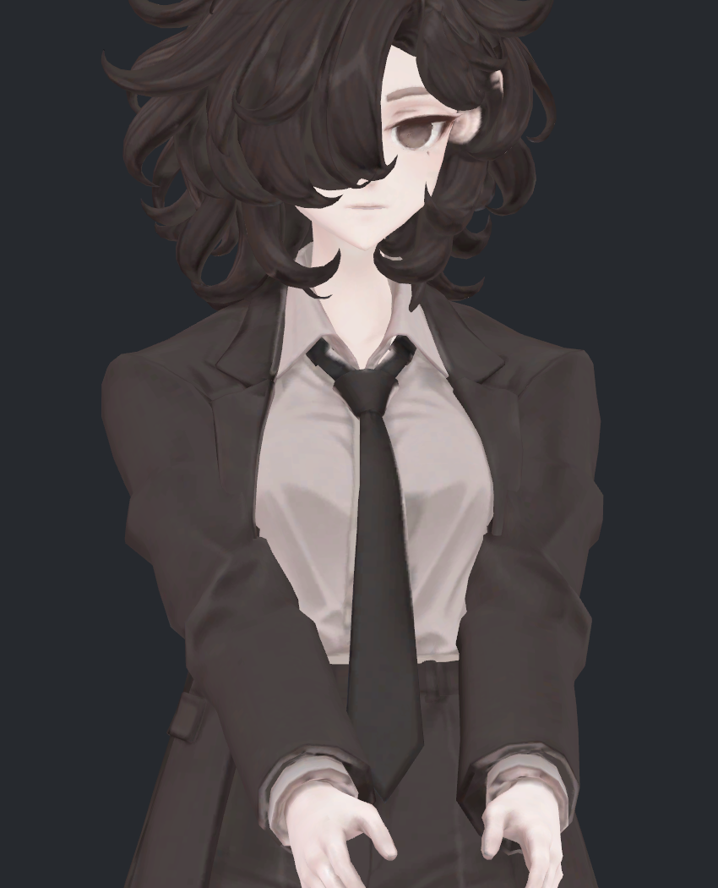
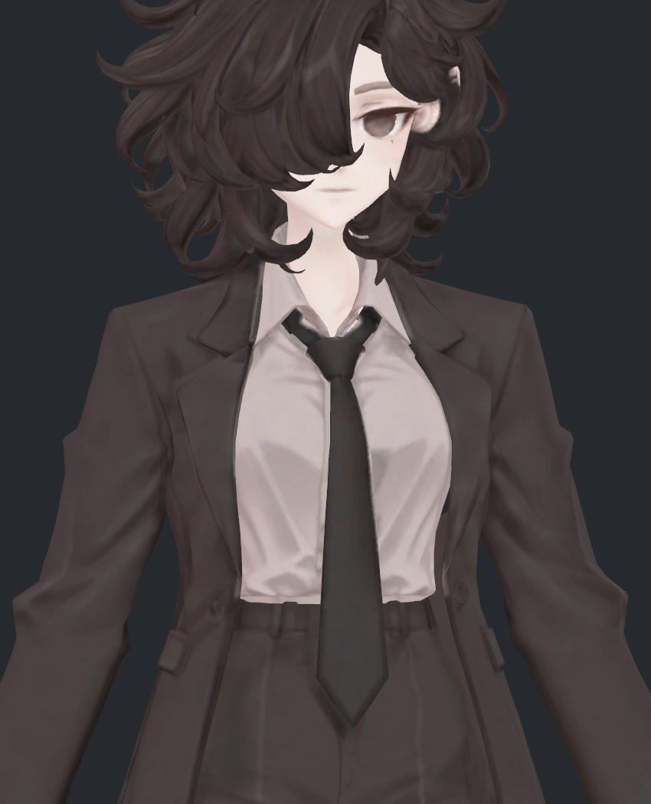

# v318 — 이번 작업 확인: 부피·주름·셔츠 접촉

2026-09-12 · 검수 범위 v309–v318

**소매 부피와 일부 면의 늘어남을 함께 제어하는 데는 진전이 있었지만, 어깨 각짐과 셔츠 교차는 해결하지 못했습니다. 이번 수정안은 모두 미채택이며 원본에 합치지 않았습니다.** 이 문서는 무엇을 실제로 바꾸어 시험했고, 무엇을 확인했으며, 왜 최종본으로 전달하지 않았는지 확인하기 위한 기록입니다.

## 먼저 볼 전후 비교

같은 복합 자세에서 기존 형상과 v316 수정안을 비교합니다. 카메라·조명·재질·기하 노멀 계산 방식은 같습니다. 사진은 직접 열어 정면과 측면을 확인했습니다.

| 기존 형상 | v316 수정안 — 미채택 |
|---|---|
|  |  |

정면에서 어깨 앞쪽이 넓고 각지게 남는 문제를 확인할 수 있습니다. 일부 접힘과 늘어남의 수치가 개선됐어도 이 모습을 자연스럽다고 판정하지 않았습니다.

이 그림들은 기존 삼각형에 계산한 좌표를 적용한 **Unity 정적 검수 화면**입니다. 새 보정이 여러 자세에서 자동으로 작동하는 최종 스키닝이나 VRChat 실행 결과는 아닙니다.

## 사용자 요청에 따라 바꾼 검사 기준

부피를 겉보기나 한 방향 폭 하나로 판단하지 않았습니다. 같은 소매 구간의 실제 단면적·최소 두께·외곽 부피를 측정하고, 삼각형의 두 방향 길이 변화와 교차를 함께 검사했습니다. 앞·옆 사진과 원형도 직접 비교했습니다.

새 캐릭터나 대체 메시를 만들지 않았습니다. 기존 정점·면을 사용한 별도 계산 사본에서 시험했고, 원본 메시·UV·본·웨이트·기존 보정 키는 유지했습니다. v318은 계산 조건이 성립하지 않아 후보 좌표 자체를 저장하지 않았습니다.

## 원인을 확인하며 수정한 내용

### 1. 원래 주름과 새로 생긴 찌그러짐을 구분

카메라 광선으로 사진에 실제 보이는 면을 찾고 원형의 같은 면과 비교했습니다. 전완의 일부 굵은 주름은 기본 자세부터 있던 조형이며, 동작 중 길이와 접힘 각도가 거의 같았습니다. 사진의 모든 굵은 주름을 새 변형 결함으로 설명했던 판단은 지나치게 넓었습니다. 원래 주름이 있다는 사실이 어깨의 잔여 각짐까지 정상이라는 뜻은 아닙니다.

기존 두께 보정 키 여섯 개만 끄는 비교도 했습니다. 어깨뿌리에는 최대 약7.60mm 영향을 주지만, 이를 끄는 것만으로 각짐은 해결되지 않았습니다. 따라서 기존 키를 일괄 제거하지 않았습니다. [v315 상세 비교](avatar_modeling/v315_volume_key_audit/README.md)

### 2. 부피 조건만 맞추면 면이 늘어나는 문제를 추가로 제한

같은 정점 띠를 추적하는 방법은 계산의 불연속을 줄였지만, 띠가 팔 축 방향으로 움직이면 실제 단면이 더 얇아지는 문제가 있었습니다. 축 방향 위치도 제한한 뒤, 원래부터 크게 접혀 검사에서 제외됐던 겨드랑이 모서리19개를 포함했습니다.

이렇게 접힘을 풀자 주변 면이 과하게 늘어나는 부작용이 생겼습니다. v316에서 삼각형의 두 방향 길이도 함께 제한했습니다.

| 확인 항목 | 앞선 v314 수정안 | v316 수정안 |
|---|---:|---:|
| 왼 소매 중앙 외곽 부피 / 중립 | 96.59% | 96.75% |
| 오른 소매 중앙 외곽 부피 / 중립 | 96.80% | 96.83% |
| 화면에서 확인한 면1659의 큰 방향 길이비 | 1.396 | 1.051 |
| 같은 면의 작은 방향 길이비 | 0.958 | 0.925 |
| 면1204의 큰 방향 길이비 | 1.336 | 1.152 |
| 기존에 없던 코트–셔츠 교차쌍 | 79 | 90 |

면1659의 큰 방향 늘어남은 약39.6%에서5.1%로 줄었습니다. 반대 방향은 약7.5% 압축돼, 늘어남과 압축을 모두 해결한 것은 아닙니다. 새 교차도 증가해 v316을 채택하지 않았습니다. [v316 상세 검수](avatar_modeling/v316_volume_shape_balance/README.md)

부피는 **위팔 축의55–85% 구간에서 양쪽 각각25개 닫힌 단면을 적분한 외곽 부피**입니다. 어깨 전체나 옷감·인체의 체적은 아닙니다. 어깨뿌리15–40%에는 독립된 소매 폐곡선이 없어 같은 방식으로 계산하지 않았습니다. 약96.8%라는 수치만으로 어깨 전체의 부피 문제가 해결됐다고 볼 수 없습니다.

### 3. 코트만 밀거나 셔츠만 미는 방법의 한계 확인

v317은 실제로 교차한 삼각형 쌍을 직접 분리하도록 했습니다. 첫 회차에서 대상으로 삼은90쌍 중89쌍을 없앴지만, 옆 면에71쌍이 새로 생겼습니다. 조건을 더 누적한 두 번째 회차도 새 교차66쌍이 남고 면적 경고7개·큰 접힘1개가 추가됐습니다. 문제를 주변으로 옮기는 결과여서 제외했습니다.

코트를 숨겨 안쪽 표면도 직접 확인했습니다. 충돌 대상으로 부르던 표면은 **옆과 뒤가 열린 셔츠 조각**이며, 속이 찬 몸통이 아닙니다. 이를 닫힌 인체처럼 취급하거나 코트만 계속 바깥으로 밀어내는 방식은 적절하지 않았습니다.

v318에서는 코트 좌표를 고정해 바깥 부피를 유지하고, 안쪽 셔츠의 기존524위치만 움직이는 조건을 시험했습니다. 선택한 분리 방향과 축별±6mm 이동 상한을 동시에 만족하는 해를 찾지 못해 적용하지 않았습니다. 이는 그 선형 조건의 실패이며, 기존 메시로 수정 자체가 불가능하다는 증명은 아닙니다. [v318 상세 결과](avatar_modeling/v318_inner_shirt_clearance/README.md)

## 검사 범위와 숫자를 읽는 방법

- 주요 수정안의 기하·접촉 검수는 팔을 앞으로 모은 복합 자세571을 대상으로 했습니다. 전체 동작이나 새 무작위 자세를 통과한 결과로 확대하지 않습니다. 기존 두께 키의 작용 비교는 중립과 좌우 기본 자세를 포함한6자세에서 했습니다.
- v316의 미분 대조9조건, 자기교차·새 큰면적·큰접힘 검사와14개 폐단면 유효성은 통과했습니다. 하지만 별도의 코트–셔츠 교차가 남았고 사진에도 각짐이 보였습니다.
- v316의 교차 해소775개는 **코트 자체558개와 코트–셔츠217개를 합한 값**입니다. 셔츠 교차775개가 해소된 것으로 읽으면 안 됩니다. 새 셔츠 교차90개는 따로 남습니다.
- 삼각형 쌍이 바뀌는 것과 새로운 접촉 영역이 생기는 것은 다릅니다. 새90쌍 중25쌍은 교차선9표본 모두 기존 교차선1mm 이내였지만, 최대 이격은8.94mm였습니다. 이 거리나 교차선 길이는 침투 깊이가 아니며, 이를 이유로 교차를 통과 처리하지 않았습니다.

## 지금 남은 작업

1. 어깨 앞쪽의 각짐을 원래 조형과 구분해 수정하고, 부피·두께·면의 늘어남을 함께 재검수해야 합니다.
2. 코트와 열린 셔츠 경계를 함께 다루면서, 기존 접촉의 이동과 새 외부 관통을 구분해야 합니다. 한쪽만 밀어내는 현재 방식은 마무리 해법이 되지 못했습니다.
3. 형상이 통과한 뒤 여러 자세와 중간 동작에서 자동 보정·실제 스키닝을 검증해야 합니다. 다른 관절의 미해결 문제도 남아 있습니다.

현재 전달할 수 있는 것은 **검수 기록과 미채택 실험 결과**입니다. 완료된 새 아바타 파일을 전달한 단계가 아닙니다. 원본은 보존했고 작업 자료는 기존 비공개 작업 저장소에 백업했습니다. 이 공유 문서에는 원본 모델·텍스처·구매 자료·실행 코드·원시 검증 데이터가 포함되지 않습니다.
